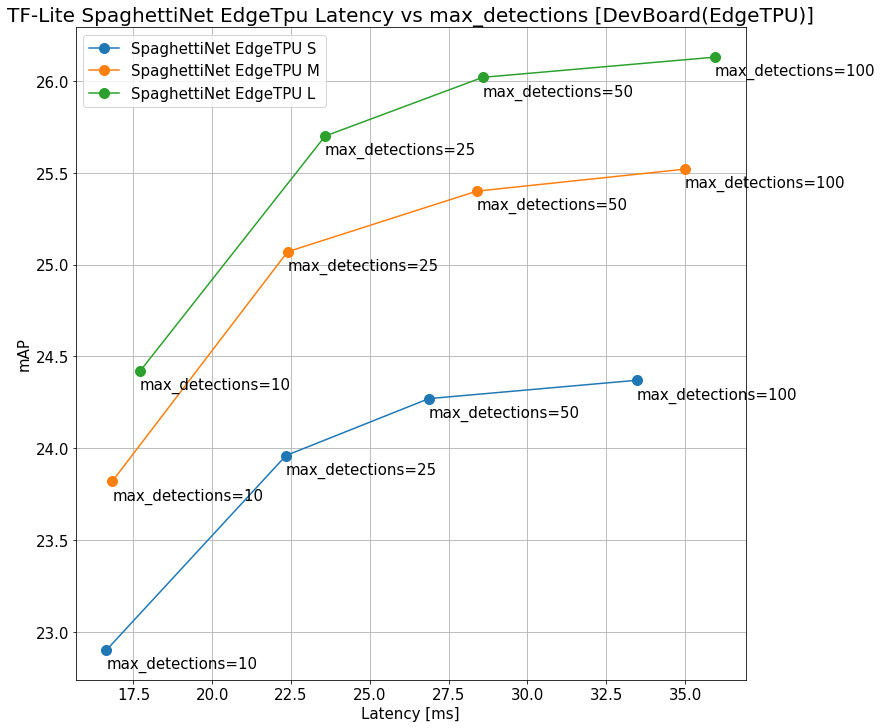

# TensorFlow-Lite SpaghettiNet EdgeTpu Latency vs max_detections

## Environment

- HW
  - RasPi4: Raspberry Pi 4 Model B Rev 1.2 4GB
  - Dev Board 1GB
- OS
  - Raspberry Pi OS 64bit (raspios_arm64-2021-04-09)
    Linux raspberrypi 5.10.36-v8+ #1418 SMP PREEMPT Thu May 13 18:19:53 BST 2021 aarch64 GNU/Linux
  - Mendel Linux  
    Linux orange-calf 4.14.98-imx #1 SMP PREEMPT Fri May 14 22:12:02 UTC 2021 aarch64 GNU/Linux
- SW
  - TensorFlow Lite 2.5.0
  - OpenCV 4.5.2 (Self build)
  - Python3 3.7.3
  - Coral EdgeTPU Delegate
    - libEdgeTPU Release Grouper
    - Edge TPU Compiler version 16.0.384591198

## Dataset
- [COCO2017](https://cocodataset.org/#home)

## How to benchmarks
Source
- [NobuoTsukamoto/tflite-cv-example](https://github.com/NobuoTsukamoto/tflite-cv-example/)

```
# AP
$ Python object_detection_benchmark_tflite.py --model PATH_TO_MODEL_FILE --images_dir /PATH_TO_COCO2017VAL --annotation_path PATH_TO_instances_val2017.json

# Latancy
$ python benchmark_tflite.py --model _PATH_TO_MODEL_FILE --thread=N(num threads) --count 1000
```

## Results
- [All results](./results)


### TF-Lite SpaghettiNet EdgeTpu Latency vs max_detections - DevBoard (EdgeTPU Delegate)



### TF-Lite SpaghettiNet EdgeTpu Latency vs max_detections - Raspberry Pi 4 64bit + EdgeTPU delegate

