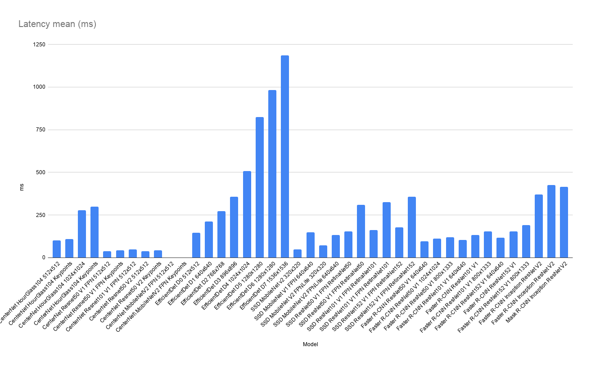

# TensorFlow 2 Detection Model Zoo Benchmarks (Colab Tesla P100)

## Environment
    
- Colab Pro
- HW
    - CPU: Intel(R) Xeon(R) CPU @ 2.30GHz 4 cores
    - GPU: NVIDIA Tesla P100
    - MEM: 25GB

## Dataset
- [COCO2017](https://cocodataset.org/#home) 

## How to benchmarks
Source
- [NobuoTsukamoto/tensorrt](https://github.com/NobuoTsukamoto/tensorrt)

Notebook
- [Colab Notebook](https://github.com/NobuoTsukamoto/tensorrt/blob/detection2/tftrt/examples/object_detection/Colab_TF2_4_1_TF2_Detection_Model_TF_TRT.ipynb)

## Parameters
- Input batch size: 1
- [TF-TRT](https://docs.nvidia.com/deeplearning/frameworks/tf-trt-user-guide/index.html)
    - Model
        - Native FP32
        - TF-TRT FP32
        - TF-TRT FP16
    - Converter Params
        - max_batch_size: 1
        - max_workspace_size_bytes: 2147483648
        - maximum_cached_engines: 1
        - minimum_segment_size: 3, 20, 50

## Results

- All results: [Colab_TF2.4.1_P100.csv](./results/Colab_TF2.4.1_P100.csv)
- Note: CenterNet MobileNetV2 (detection and keypoints) will result in an error inference by the saved model.

| Model                               | Input     |   mAP |   latency(ms) |
|:------------------------------------|:----------|------:|--------------:|
| CenterNet HourGlass104              | 512x512   | 38.47 |        100.49 |
| CenterNet HourGlass104 Keypoints    | 512x512   | 36.73 |        108.91 |
| CenterNet HourGlass104              | 1024x1024 | 39.76 |        277.89 |
| CenterNet HourGlass104 Keypoints    | 1024x1024 | 38.48 |        299.93 |
| CenterNet Resnet50 V1 FPN           | 512x512   | 27.59 |         37.05 |
| CenterNet Resnet50 V1 FPN Keypoints | 512x512   | 25.76 |         42.54 |
| CenterNet Resnet101 V1 FPN          | 512x512   | 31.28 |         47.16 |
| CenterNet Resnet50 V2               | 512x512   | 26.23 |         36.8  |
| CenterNet Resnet50 V2 Keypoints     | 512x512   | 24.49 |         42.36 |
| CenterNet MobileNetV2 FPN           | 512x512   |  0    |          0    |
| CenterNet MobileNetV2 FPN Keypoints | 512x512   |  0    |          0    |
| EfficientDet D0                     | 512x512   | 32.82 |        146.18 |
| EfficientDet D1                     | 640x640   | 36.63 |        210.53 |
| EfficientDet D2                     | 768x768   | 39.84 |        273.42 |
| EfficientDet D3                     | 896x896   | 42.48 |        356.11 |
| EfficientDet D4                     | 1024x1024 | 45.65 |        507.74 |
| EfficientDet D5                     | 1280x1280 | 46.14 |        825.46 |
| EfficientDet D6                     | 1280x1280 | 46.6  |        982.43 |
| EfficientDet D7                     | 1536x1536 | 47.75 |       1187.02 |
| SSD MobileNet v2                    | 320x320   | 20.02 |         47.42 |
| SSD MobileNet V1 FPN                | 640x640   | 28.67 |        147.5  |
| SSD MobileNet V2 FPNLite            | 320x320   | 22.1  |         71.34 |
| SSD MobileNet V2 FPNLite            | 640x640   | 27.69 |        133.55 |
| SSD ResNet50 V1 FPN RetinaNet50     | 640x640   | 33.7  |        154.92 |
| SSD ResNet50 V1 FPN RetinaNet50     | 1024x1024 | 37.58 |        310.2  |
| SSD ResNet101 V1 FPN RetinaNet101   | 640x640   | 35.03 |        162.86 |
| SSD ResNet101 V1 FPN RetinaNet101   | 1024x1024 | 38.76 |        325.68 |
| SSD ResNet152 V1 FPN RetinaNet152   | 640x640   | 34.85 |        177.29 |
| SSD ResNet152 V1 FPN RetinaNet152   | 1024x1024 | 38.9  |        357.52 |
| Faster R-CNN ResNet50 V1            | 640x640   | 27.94 |         94.27 |
| Faster R-CNN ResNet50 V1            | 1024x1024 | 30.66 |        112.47 |
| Faster R-CNN ResNet50 V1            | 800x1333  | 26.66 |        118.31 |
| Faster R-CNN ResNet101 V1           | 640x640   | 30.2  |        103.87 |
| Faster R-CNN ResNet101 V1           | 1024x1024 | 36.56 |        131.79 |
| Faster R-CNN ResNet101 V1           | 800x1333  | 31.45 |        153.31 |
| Faster R-CNN ResNet152 V1           | 640x640   | 31.16 |        115.56 |
| Faster R-CNN ResNet152 V1           | 1024x1024 | 36.86 |        154.98 |
| Faster R-CNN ResNet152 V1           | 800x1333  | 32.75 |        189.54 |
| Faster R-CNN Inception ResNet V2    | 640x640   | 36.89 |        369.53 |
| Faster R-CNN Inception ResNet V2    | 1024x1024 | 36.02 |        425.06 |
| Mask R-CNN Inception ResNet V2      | 1024x1024 | 37.94 |        413.84 |

### Latency mean (ms)

