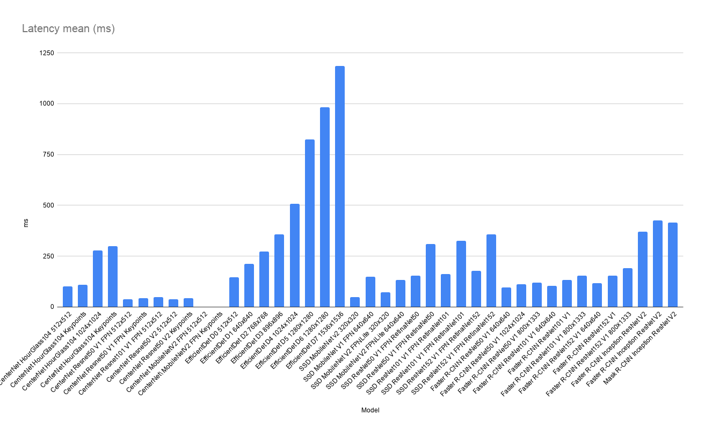

# TensorFlow 2 Detection Model Zoo Benchmarks

## Environment
    
- Colab Pro
- HW
    - CPU: Intel(R) Xeon(R) CPU @ 2.30GHz 4 cores
    - GPU: NVIDIA Tesla P100
    - MEM: 25GB

## Dataset
- [COCO2017](https://cocodataset.org/#home) 

## How to benchmarks

Notebook will be up soon.

## Parameters
- Input batch size: 1

## Results

Note: CenterNet MobileNetV2 (detection and keypoints) will result in an error inference by the saved model.

| Model                               | Input     | TF-TRT      |    AP |   AP50 |   AP75 |   APsmall |   APmedium |   APlarge |   ARmax=1 |   ARmax=10 |   ARmax=100 |   ARsmall |   ARmidium |   ARlarge |   images/sec |   99th_percentile(ms) |   total_time(s) |   latency_mean(ms) |   latency_median(ms) |   latency_min(ms) |
|:------------------------------------|:----------|:------------|------:|-------:|-------:|----------:|-----------:|----------:|----------:|-----------:|------------:|----------:|-----------:|----------:|-------------:|----------------------:|----------------:|-------------------:|---------------------:|------------------:|
| CenterNet HourGlass104              | 512x512   | Native FP32 | 38.47 |  56.41 |  41.16 |     19.82 |      42.5  |     52.74 |     32.48 |      52.7  |       55.59 |     33.27 |      60.56 |     74.12 |         9.95 |                103.96 |          497.4  |             100.49 |               100.39 |             96.66 |
| CenterNet HourGlass104 Keypoints    | 512x512   | Native FP32 | 36.73 |  54.6  |  38.91 |     18.23 |      40.34 |     51.14 |     31.32 |      50.6  |       53.34 |     31.41 |      57.42 |     72.56 |         9.18 |                112.76 |          539.11 |             108.91 |               108.84 |            103.86 |
| CenterNet HourGlass104              | 1024x1024 | Native FP32 | 39.76 |  56.45 |  43.57 |     24.72 |      43.93 |     51.35 |     33.63 |      55.84 |       59.65 |     40.48 |      63.34 |     75.56 |         3.6  |                281.68 |         1375.56 |             277.89 |               277.83 |            273.74 |
| CenterNet HourGlass104 Keypoints    | 1024x1024 | Native FP32 | 38.48 |  55.13 |  42.04 |     22.9  |      42.2  |     51.3  |     32.89 |      54.22 |       57.81 |     38.5  |      61.51 |     74.07 |         3.33 |                304.79 |         1484.65 |             299.93 |               299.92 |            293.45 |
| CenterNet Resnet50 V1 FPN           | 512x512   | Native FP32 | 27.59 |  43.75 |  29.12 |     11.66 |      32.51 |     40.57 |     26.98 |      43.34 |       45.45 |     22.95 |      49.26 |     64.83 |        27    |                 40.48 |          183.41 |              37.05 |                36.9  |             35.91 |
| CenterNet Resnet50 V1 FPN Keypoints | 512x512   | Native FP32 | 25.76 |  42.1  |  27.3  |     10.99 |      29.61 |     38.34 |     25.52 |      41.16 |       43.09 |     21.74 |      46.71 |     61.28 |        23.52 |                 46.62 |          210.56 |              42.54 |                42.47 |             39.27 |
| CenterNet Resnet101 V1 FPN          | 512x512   | Native FP32 | 31.28 |  47.88 |  33.01 |     12.09 |      34.92 |     46.71 |     29.12 |      45.41 |       47.26 |     22.93 |      50.61 |     69.23 |        21.21 |                 50.1  |          233.46 |              47.16 |                47    |             45.75 |
| CenterNet Resnet50 V2               | 512x512   | Native FP32 | 26.23 |  41.57 |  27.76 |      9.95 |      31.54 |     39.23 |     26.33 |      41.44 |       43.27 |     18.34 |      47.59 |     65.32 |        27.19 |                 40.15 |          182.15 |              36.8  |                36.58 |             35.46 |
| CenterNet Resnet50 V2 Keypoints     | 512x512   | Native FP32 | 24.49 |  40.07 |  25.59 |      9    |      28.97 |     38.17 |     25.04 |      39.55 |       41.2  |     17.64 |      45.14 |     63    |        23.63 |                 46.75 |          209.7  |              42.36 |                42.23 |             38.77 |
| CenterNet MobileNetV2 FPN           | 512x512   | Native FP32 |  0    |   0    |   0    |      0    |       0    |      0    |      0    |       0    |        0    |      0    |       0    |      0    |         0    |                  0    |            0    |               0    |                 0    |              0    |
| CenterNet MobileNetV2 FPN Keypoints | 512x512   | Native FP32 |  0    |   0    |   0    |      0    |       0    |      0    |      0    |       0    |        0    |      0    |       0    |      0    |         0    |                  0    |            0    |               0    |                 0    |              0    |
| EfficientDet D0                     | 512x512   | Native FP32 | 32.82 |  51.62 |  34.42 |     14.35 |      36.89 |     50.22 |     28.68 |      44.11 |       46.87 |     23.16 |      53.19 |     67.98 |         6.88 |                171.23 |          723.61 |             146.18 |               145.53 |            116.06 |
| EfficientDet D1                     | 640x640   | Native FP32 | 36.63 |  56    |  38.81 |     16.97 |      40.65 |     54.31 |     30.96 |      48.21 |       51.23 |     27.8  |      56.65 |     71.38 |         4.77 |                239.87 |         1042.14 |             210.53 |               210.23 |            169.27 |
| EfficientDet D2                     | 768x768   | Native FP32 | 39.84 |  59.45 |  42.39 |     20.98 |      44.41 |     56.1  |     33.2  |      51.74 |       55.07 |     33.64 |      60.15 |     73.92 |         3.67 |                310.92 |         1353.44 |             273.42 |               273    |            226.13 |
| EfficientDet D3                     | 896x896   | Native FP32 | 42.48 |  62.19 |  45.4  |     24.76 |      46.36 |     58.35 |     34.12 |      54.34 |       57.81 |     37.31 |      62.58 |     75.01 |         2.81 |                397.05 |         1762.73 |             356.11 |               355.45 |            291.69 |
| EfficientDet D4                     | 1024x1024 | Native FP32 | 45.65 |  66.27 |  48.98 |     29.17 |      50.01 |     61.53 |     35.69 |      56.93 |       60.54 |     43.06 |      65.12 |     76.9  |         1.97 |                566.63 |         2513.32 |             507.74 |               507.64 |            413.97 |
| EfficientDet D5                     | 1280x1280 | Native FP32 | 46.14 |  66.64 |  49.74 |     29.63 |      50.64 |     60.81 |     35.91 |      58.2  |       61.9  |     44.3  |      66.39 |     77.17 |         1.21 |                899.01 |         4086.04 |             825.46 |               824.7  |            716.71 |
| EfficientDet D6                     | 1280x1280 | Native FP32 | 46.6  |  67.04 |  50.19 |     31.29 |      51.49 |     60.33 |     36.24 |      58.82 |       62.55 |     45.85 |      67.05 |     77.61 |         1.02 |               1067.93 |         4863.01 |             982.43 |               981.33 |            853.44 |
| EfficientDet D7                     | 1536x1536 | Native FP32 | 47.75 |  68.14 |  51.19 |     31.74 |      52.07 |     62.86 |     36.72 |      59.43 |       63.17 |     46.49 |      67.6  |     78.71 |         0.84 |               1303.45 |         5875.76 |            1187.02 |              1186.01 |           1009.12 |
| SSD MobileNet v2                    | 320x320   | Native FP32 | 20.02 |  34.55 |  19.91 |      2.3  |      17.24 |     41.34 |     21.25 |      32.51 |       34.44 |      6.86 |      35.13 |     65.43 |        21.14 |                 54.14 |          234.75 |              47.42 |                47.17 |             39.8  |
| SSD MobileNet V1 FPN                | 640x640   | Native FP32 | 28.67 |  46.11 |  30.52 |     13.14 |      31.25 |     41.51 |     26.83 |      43.38 |       46.85 |     23.85 |      51.03 |     66.22 |         6.79 |                161.47 |          730.12 |             147.5  |               147.63 |            123.17 |
| SSD MobileNet V2 FPNLite            | 320x320   | Native FP32 | 22.1  |  37.25 |  22.81 |      5.12 |      23.39 |     38.49 |     21.77 |      33.62 |       36.22 |      7.77 |      41.81 |     60.83 |        14.05 |                 80.64 |          353.13 |              71.34 |                71.11 |             61.3  |
| SSD MobileNet V2 FPNLite            | 640x640   | Native FP32 | 27.69 |  46.1  |  29.15 |     11.51 |      30.39 |     41.05 |     25.45 |      40.67 |       43.85 |     21.21 |      48.31 |     62.72 |         7.5  |                146.8  |          661.05 |             133.55 |               133.56 |            111.32 |
| SSD ResNet50 V1 FPN RetinaNet50     | 640x640   | Native FP32 | 33.7  |  51.8  |  36.63 |     15.52 |      37.06 |     49.51 |     29.89 |      47.37 |       50.94 |     27.28 |      55.93 |     71.63 |         6.46 |                167.23 |          766.87 |             154.92 |               154.87 |            137.57 |
| SSD ResNet50 V1 FPN RetinaNet50     | 1024x1024 | Native FP32 | 37.58 |  56.95 |  40.29 |     19.71 |      41.18 |     50.87 |     32    |      51.43 |       54.98 |     33.85 |      58.33 |     72.7  |         3.23 |                328.88 |         1535.51 |             310.2  |               310.34 |            265.2  |
| SSD ResNet101 V1 FPN RetinaNet101   | 640x640   | Native FP32 | 35.03 |  53.18 |  38.11 |     16.12 |      39.12 |     50.85 |     30.6  |      48.47 |       51.94 |     28.01 |      56.96 |     72.62 |         6.15 |                178.45 |          806.17 |             162.86 |               162.96 |            141.34 |
| SSD ResNet101 V1 FPN RetinaNet101   | 1024x1024 | Native FP32 | 38.76 |  58.03 |  42.08 |     20.6  |      42.45 |     53.08 |     32.55 |      52.15 |       55.64 |     34.37 |      59.74 |     73.98 |         3.07 |                346.32 |         1612.1  |             325.68 |               325.71 |            282.58 |
| SSD ResNet152 V1 FPN RetinaNet152   | 640x640   | Native FP32 | 34.85 |  52.83 |  37.66 |     15.82 |      38.55 |     51.02 |     30.4  |      48.06 |       51.62 |     27.73 |      57.25 |     71.76 |         5.65 |                190.03 |          877.61 |             177.29 |               177.24 |            157.2  |
| SSD ResNet152 V1 FPN RetinaNet152   | 1024x1024 | Native FP32 | 38.9  |  58.12 |  42.1  |     20.66 |      42.53 |     53.18 |     32.61 |      52.14 |       55.8  |     34.02 |      59.82 |     74.04 |         2.8  |                376.88 |         1769.71 |             357.52 |               357.47 |            310.82 |
| Faster R-CNN ResNet50 V1            | 640x640   | Native FP32 | 27.94 |  45.81 |  29.32 |      9.3  |      30.66 |     45.27 |     26.6  |      41.96 |       44.8  |     19.99 |      49.65 |     69.09 |        10.62 |                101.6  |          466.66 |              94.27 |                94.5  |             82.64 |
| Faster R-CNN ResNet50 V1            | 1024x1024 | Native FP32 | 30.66 |  50.12 |  31.9  |     14.25 |      36.84 |     44.42 |     27.82 |      45.22 |       48.63 |     28.41 |      55.2  |     67.01 |         8.91 |                123.05 |          556.75 |             112.47 |               112.64 |             99.9  |
| Faster R-CNN ResNet50 V1            | 800x1333  | Native FP32 | 26.66 |  45.75 |  27.14 |     15.55 |      33.24 |     35.05 |     24.45 |      41.39 |       43.61 |     26.82 |      49.03 |     58.3  |         8.46 |                126.53 |          585.64 |             118.31 |               118.55 |            107    |
| Faster R-CNN ResNet101 V1           | 640x640   | Native FP32 | 30.2  |  48.11 |  31.75 |     10.36 |      33.2  |     47.35 |     28.1  |      43.72 |       46.49 |     21.79 |      51.78 |     69.15 |         9.64 |                111.12 |          514.13 |             103.87 |               103.85 |             93.7  |
| Faster R-CNN ResNet101 V1           | 1024x1024 | Native FP32 | 36.56 |  55.94 |  38.88 |     17.59 |      40.82 |     53.95 |     31.98 |      50.45 |       53.91 |     33.18 |      58.53 |     73.96 |         7.6  |                141.17 |          652.34 |             131.79 |               131.68 |            120.63 |
| Faster R-CNN ResNet101 V1           | 800x1333  | Native FP32 | 31.45 |  51.15 |  32.73 |     16.43 |      37.06 |     41.5  |     27.18 |      45.39 |       47.85 |     28.39 |      53.6  |     63.29 |         6.53 |                161.33 |          758.87 |             153.31 |               153.5  |            142.77 |
| Faster R-CNN ResNet152 V1           | 640x640   | Native FP32 | 31.16 |  49.03 |  32.74 |     10.89 |      34.36 |     49.49 |     28.71 |      44.8  |       47.77 |     22.93 |      53.25 |     70.31 |         8.66 |                122.77 |          572.03 |             115.56 |               115.48 |            106.3  |
| Faster R-CNN ResNet152 V1           | 1024x1024 | Native FP32 | 36.86 |  55.72 |  39.19 |     16.9  |      41.38 |     54.49 |     32.52 |      51.19 |       54.65 |     33.01 |      59.42 |     74.58 |         6.46 |                164.56 |          767.15 |             154.98 |               154.83 |            142.25 |
| Faster R-CNN ResNet152 V1           | 800x1333  | Native FP32 | 32.75 |  52.31 |  34.77 |     17.26 |      37.86 |     43.73 |     28.36 |      46.5  |       48.88 |     29.89 |      54.22 |     64.48 |         5.28 |                197.52 |          938.25 |             189.54 |               189.64 |            178.74 |
| Faster R-CNN Inception ResNet V2    | 640x640   | Native FP32 | 36.89 |  56.15 |  38.83 |     15.38 |      41.3  |     55.93 |     31.79 |      49.11 |       51.53 |     26.9  |      57.05 |     73.97 |         2.71 |                378.49 |         1829.19 |             369.53 |               369.43 |            359.23 |
| Faster R-CNN Inception ResNet V2    | 1024x1024 | Native FP32 | 36.02 |  57.33 |  37.88 |     16.47 |      40.47 |     52.54 |     30.98 |      47.99 |       50.5  |     28.83 |      55.43 |     69.82 |         2.35 |                432.54 |         2104.03 |             425.06 |               424.94 |            415.03 |
| Mask R-CNN Inception ResNet V2      | 1024x1024 | Native FP32 | 37.94 |  59.15 |  40.59 |     18.71 |      42.27 |     53.82 |     31.86 |      49.76 |       52.28 |     31.16 |      57.22 |     71.05 |         2.43 |                551.52 |         2048.51 |             413.84 |               402.45 |            389.71 |

### Latency mean (ms)

