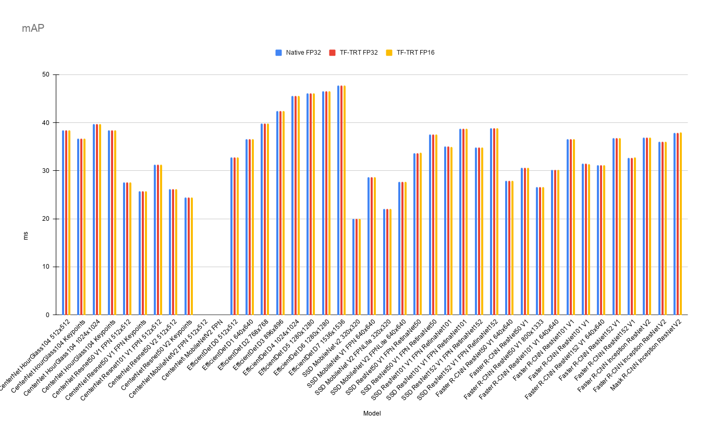
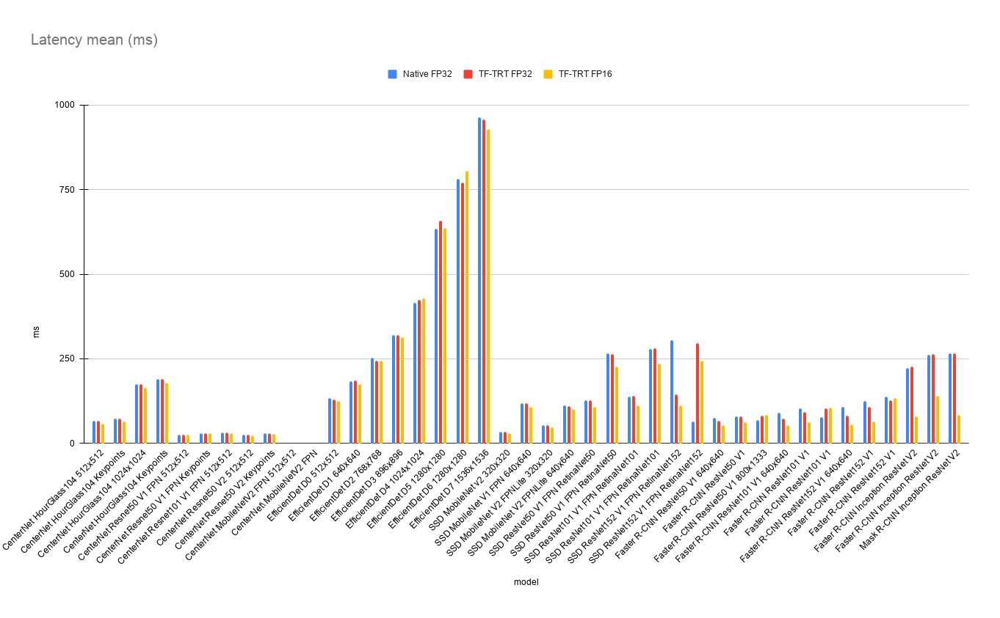
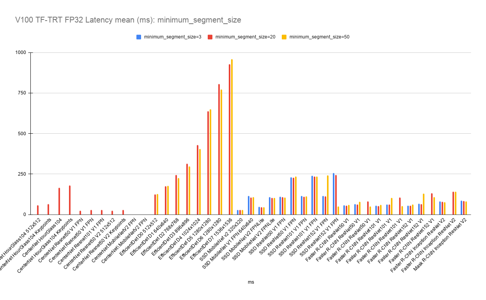
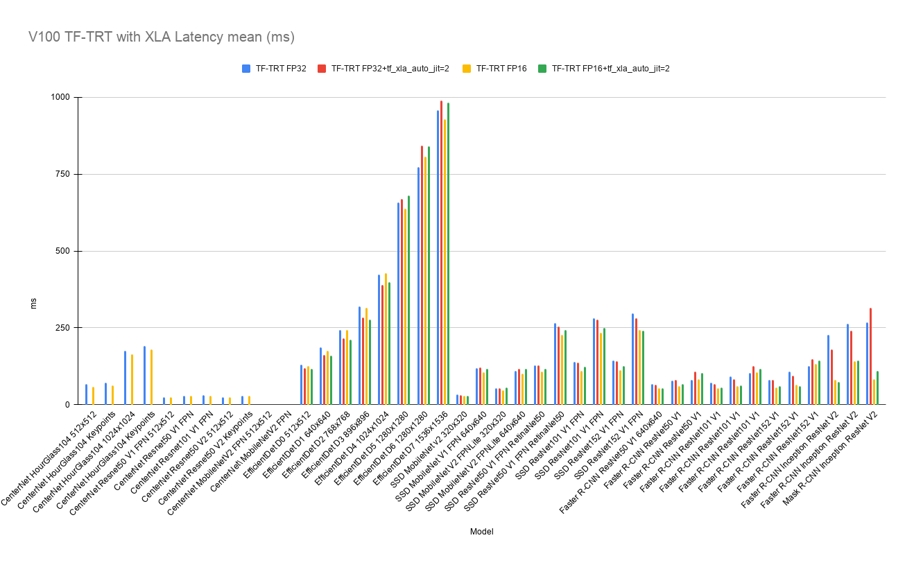

# TensorFlow 2 Detection Model Zoo Benchmarks

## Environment
    
- Colab Pro
- HW
    - CPU: Intel(R) Xeon(R) CPU @ 2.30GHz 4 cores
    - GPU: NVIDIA Tesla P100
    - MEM: 25GB

## Dataset
- [COCO2017](https://cocodataset.org/#home) 

## How to benchmarks

Notebook will be up soon.

## Parameters
- Input batch size: 1
- TrtGraphConverterV2
    - max_workspace_size_bytes = 2147483648 (2GB)
    - minimum_segment_size = 20

## Results

- All results: [Colab_TF2.4.1_P100Colab_TF2.4.1_V100_minimum_segment_size_20.csv](./results/Colab_TF2.4.1_V100_minimum_segment_size_20.csv)
- Note: CenterNet MobileNetV2 (detection and keypoints) will result in an error inference by the saved model.

## mAP
| Model                               | Input     |   Native FP32 |   TF-TRT FP32 |   TF-TRT FP16 |
|:------------------------------------|:----------|--------------:|--------------:|--------------:|
| CenterNet HourGlass104              | 512x512   |         38.47 |         38.47 |         38.47 |
| CenterNet HourGlass104 Keypoints    | 512x512   |         36.73 |         36.73 |         36.73 |
| CenterNet HourGlass104              | 1024x1024 |         39.76 |         39.76 |         39.76 |
| CenterNet HourGlass104 Keypoints    | 1024x1024 |         38.48 |         38.48 |         38.48 |
| CenterNet MobileNetV2 FPN           | nan       |         27.59 |         27.59 |         27.59 |
| CenterNet MobileNetV2 FPN Keypoints | nan       |         25.76 |         25.76 |         25.76 |
| CenterNet Resnet50 V1 FPN           | 512x512   |         31.28 |         31.28 |         31.28 |
| CenterNet Resnet50 V1 FPN Keypoints | 512x512   |         26.23 |         26.23 |         26.23 |
| CenterNet Resnet101 V1 FPN          | 512x512   |         24.49 |         24.49 |         24.49 |
| CenterNet Resnet50 V2               | 512x512   |          0    |          0    |          0    |
| CenterNet Resnet50 V2 Keypoints     | 512x512   |          0    |          0    |          0    |
| EfficientDet D0                     | 512x512   |         32.82 |         32.82 |         32.82 |
| EfficientDet D1                     | 640x640   |         36.63 |         36.63 |         36.63 |
| EfficientDet D2                     | 768x768   |         39.84 |         39.84 |         39.84 |
| EfficientDet D3                     | 896x896   |         42.48 |         42.48 |         42.48 |
| EfficientDet D4                     | 1024x1024 |         45.65 |         45.65 |         45.65 |
| EfficientDet D5                     | 1280x1280 |         46.14 |         46.14 |         46.14 |
| EfficientDet D6                     | 1280x1280 |         46.6  |         46.6  |         46.57 |
| EfficientDet D7                     | 1536x1536 |         47.75 |         47.75 |         47.75 |
| SSD MobileNet v2                    | 320x320   |         20.02 |         20.02 |         20.01 |
| SSD MobileNet V1 FPN                | 640x640   |         28.67 |         28.67 |         28.67 |
| SSD MobileNet V2 FPNLite            | 320x320   |         22.1  |         22.1  |         22.1  |
| SSD MobileNet V2 FPNLite            | 640x640   |         27.69 |         27.69 |         27.7  |
| SSD ResNet50 V1 FPN RetinaNet50     | 640x640   |         33.7  |         33.7  |         33.74 |
| SSD ResNet50 V1 FPN RetinaNet50     | 1024x1024 |         37.58 |         37.58 |         37.57 |
| SSD ResNet101 V1 FPN RetinaNet101   | 640x640   |         35.03 |         35.03 |         34.99 |
| SSD ResNet101 V1 FPN RetinaNet101   | 1024x1024 |         38.76 |         38.76 |         38.75 |
| SSD ResNet152 V1 FPN RetinaNet152   | 640x640   |         34.85 |         34.85 |         34.84 |
| SSD ResNet152 V1 FPN RetinaNet152   | 1024x1024 |         38.9  |         38.9  |         38.91 |
| Faster R-CNN ResNet50 V1            | 640x640   |         27.94 |         27.94 |         27.94 |
| Faster R-CNN ResNet50 V1            | 1024x1024 |         30.66 |         30.66 |         30.66 |
| Faster R-CNN ResNet50 V1            | 800x1333  |         26.66 |         26.66 |         26.66 |
| Faster R-CNN ResNet101 V1           | 640x640   |         30.2  |         30.2  |         30.19 |
| Faster R-CNN ResNet101 V1           | 1024x1024 |         36.56 |         36.56 |         36.55 |
| Faster R-CNN ResNet101 V1           | 800x1333  |         31.45 |         31.45 |         31.44 |
| Faster R-CNN ResNet152 V1           | 640x640   |         31.16 |         31.16 |         31.16 |
| Faster R-CNN ResNet152 V1           | 1024x1024 |         36.86 |         36.86 |         36.84 |
| Faster R-CNN ResNet152 V1           | 800x1333  |         32.75 |         32.75 |         32.77 |
| Faster R-CNN Inception ResNet V2    | 640x640   |         36.89 |         36.89 |         36.9  |
| Faster R-CNN Inception ResNet V2    | 1024x1024 |         36.02 |         36.02 |         36.04 |
| Mask R-CNN Inception ResNet V2      | 1024x1024 |         37.94 |         37.94 |         37.98 |

 

 

## Latency mean (ms)
| Model                               | Input     |   Native FP32 |   TF-TRT FP32 |   TF-TRT FP16 |
|:------------------------------------|:----------|--------------:|--------------:|--------------:|
| CenterNet HourGlass104              | 512x512   |         67.64 |         66.79 |         58.05 |
| CenterNet HourGlass104 Keypoints    | 512x512   |         72.77 |         72.91 |         63.84 |
| CenterNet HourGlass104              | 1024x1024 |        174.39 |        174.95 |        164.7  |
| CenterNet HourGlass104 Keypoints    | 1024x1024 |        189.25 |        190.4  |        179.97 |
| CenterNet MobileNetV2 FPN           | nan       |         25.52 |         25.75 |         24.9  |
| CenterNet MobileNetV2 FPN Keypoints | nan       |         29.43 |         29.55 |         28.69 |
| CenterNet Resnet50 V1 FPN           | 512x512   |         31.9  |         31.63 |         30.05 |
| CenterNet Resnet50 V1 FPN Keypoints | 512x512   |         25    |         25.3  |         24.31 |
| CenterNet Resnet101 V1 FPN          | 512x512   |         28.77 |         29.09 |         28.1  |
| CenterNet Resnet50 V2               | 512x512   |          0    |          0    |          0    |
| CenterNet Resnet50 V2 Keypoints     | 512x512   |          0    |          0    |          0    |
| EfficientDet D0                     | 512x512   |        134.86 |        130.41 |        125.47 |
| EfficientDet D1                     | 640x640   |        184.7  |        185.86 |        175.73 |
| EfficientDet D2                     | 768x768   |        252.79 |        243.42 |        244.33 |
| EfficientDet D3                     | 896x896   |        319.18 |        319.89 |        314.55 |
| EfficientDet D4                     | 1024x1024 |        414.85 |        424.16 |        428.63 |
| EfficientDet D5                     | 1280x1280 |        634.91 |        657.84 |        637.22 |
| EfficientDet D6                     | 1280x1280 |        782.6  |        772.02 |        805.51 |
| EfficientDet D7                     | 1536x1536 |        964.21 |        957.81 |        928.26 |
| SSD MobileNet v2                    | 320x320   |         33.75 |         33.87 |         29.47 |
| SSD MobileNet V1 FPN                | 640x640   |        118.59 |        119.39 |        106.72 |
| SSD MobileNet V2 FPNLite            | 320x320   |         53.22 |         54.52 |         46.41 |
| SSD MobileNet V2 FPNLite            | 640x640   |        111.49 |        110.24 |        102.21 |
| SSD ResNet50 V1 FPN RetinaNet50     | 640x640   |        127.95 |        127.84 |        107.24 |
| SSD ResNet50 V1 FPN RetinaNet50     | 1024x1024 |        264.94 |        264.82 |        227.36 |
| SSD ResNet101 V1 FPN RetinaNet101   | 640x640   |        137.92 |        139.75 |        111.07 |
| SSD ResNet101 V1 FPN RetinaNet101   | 1024x1024 |        279.92 |        282.07 |        234.74 |
| SSD ResNet152 V1 FPN RetinaNet152   | 640x640   |        304.83 |        144.66 |        112.2  |
| SSD ResNet152 V1 FPN RetinaNet152   | 1024x1024 |         63.95 |        296.69 |        243.92 |
| Faster R-CNN ResNet50 V1            | 640x640   |         76.19 |         67.51 |         54.31 |
| Faster R-CNN ResNet50 V1            | 1024x1024 |         78.61 |         78.9  |         61.45 |
| Faster R-CNN ResNet50 V1            | 800x1333  |         69.69 |         81.46 |         82.88 |
| Faster R-CNN ResNet101 V1           | 640x640   |         90.04 |         72.21 |         53.52 |
| Faster R-CNN ResNet101 V1           | 1024x1024 |        102.49 |         92.29 |         61.31 |
| Faster R-CNN ResNet101 V1           | 800x1333  |         77.54 |        103.6  |        106.49 |
| Faster R-CNN ResNet152 V1           | 640x640   |        107.07 |         81.44 |         55.28 |
| Faster R-CNN ResNet152 V1           | 1024x1024 |        124.24 |        108.71 |         64.5  |
| Faster R-CNN ResNet152 V1           | 800x1333  |        137.98 |        126.27 |        132.89 |
| Faster R-CNN Inception ResNet V2    | 640x640   |        223.62 |        227.39 |         80.42 |
| Faster R-CNN Inception ResNet V2    | 1024x1024 |        262.42 |        263.3  |        141.16 |
| Mask R-CNN Inception ResNet V2      | 1024x1024 |        266.77 |        266.89 |         82.93 |

 

 

## minimum_segment_size

Note: "0" is the model that could not be converted.

### TF-TRT FP32

| Model                               | Input     |      3 |     20 |     50 |
|:------------------------------------|:----------|-------:|-------:|-------:|
| CenterNet HourGlass104              | 512x512   |   0    |  66.79 |   0    |
| CenterNet HourGlass104 Keypoints    | 512x512   |   0    |  72.91 |   0    |
| CenterNet HourGlass104              | 1024x1024 |   0    | 174.95 |   0    |
| CenterNet HourGlass104 Keypoints    | 1024x1024 |   0    | 190.4  |   0    |
| CenterNet MobileNetV2 FPN           | nan       |   0    |  25.75 |   0    |
| CenterNet MobileNetV2 FPN Keypoints | nan       |   0    |  29.55 |   0    |
| CenterNet Resnet50 V1 FPN           | 512x512   |   0    |  31.63 |   0    |
| CenterNet Resnet50 V1 FPN Keypoints | 512x512   |   0    |  25.3  |   0    |
| CenterNet Resnet101 V1 FPN          | 512x512   |   0    |  29.09 |   0    |
| CenterNet Resnet50 V2               | 512x512   |   0    |   0    |   0    |
| CenterNet Resnet50 V2 Keypoints     | 512x512   |   0    |   0    | nan    |
| EfficientDet D0                     | 512x512   | 116.21 | 130.41 | 128.32 |
| EfficientDet D1                     | 640x640   |   0    | 185.86 | 173.4  |
| EfficientDet D2                     | 768x768   |   0    | 243.42 | 234.32 |
| EfficientDet D3                     | 896x896   |   0    | 319.89 | 303.35 |
| EfficientDet D4                     | 1024x1024 |   0    | 424.16 | 412.65 |
| EfficientDet D5                     | 1280x1280 |   0    | 657.84 | 653.19 |
| EfficientDet D6                     | 1280x1280 |   0    | 772.02 | 787.7  |
| EfficientDet D7                     | 1536x1536 |   0    | 957.81 | 951.71 |
| SSD MobileNet v2                    | 320x320   |  30.58 |  33.87 |  29.67 |
| SSD MobileNet V1 FPN                | 640x640   | 118.68 | 119.39 | 112.6  |
| SSD MobileNet V2 FPNLite            | 320x320   |  48.31 |  54.52 |  46.99 |
| SSD MobileNet V2 FPNLite            | 640x640   | 106.62 | 110.24 | 107.12 |
| SSD ResNet50 V1 FPN RetinaNet50     | 640x640   | 121.06 | 127.84 | 115.11 |
| SSD ResNet50 V1 FPN RetinaNet50     | 1024x1024 | 252.98 | 264.82 | 253.43 |
| SSD ResNet101 V1 FPN RetinaNet101   | 640x640   | 125.29 | 139.75 | 123.56 |
| SSD ResNet101 V1 FPN RetinaNet101   | 1024x1024 | 274.29 | 282.07 | 259.68 |
| SSD ResNet152 V1 FPN RetinaNet152   | 640x640   | 131.85 | 144.66 | 274.66 |
| SSD ResNet152 V1 FPN RetinaNet152   | 1024x1024 | 291.46 | 296.69 |  63.17 |
| Faster R-CNN ResNet50 V1            | 640x640   |  67.61 |  67.51 |  73.01 |
| Faster R-CNN ResNet50 V1            | 1024x1024 |  79.04 |  78.9  |  86.15 |
| Faster R-CNN ResNet50 V1            | 800x1333  |   0    |  81.46 |  65.27 |
| Faster R-CNN ResNet101 V1           | 640x640   |  69.75 |  72.21 |  80.55 |
| Faster R-CNN ResNet101 V1           | 1024x1024 |  82.46 |  92.29 | 110.96 |
| Faster R-CNN ResNet101 V1           | 800x1333  |   0    | 103.6  |  70.93 |
| Faster R-CNN ResNet152 V1           | 640x640   |  73.07 |  81.44 |  90.83 |
| Faster R-CNN ResNet152 V1           | 1024x1024 |  91.86 | 108.71 | 138.11 |
| Faster R-CNN ResNet152 V1           | 800x1333  | 141.24 | 126.27 | 124.31 |
| Faster R-CNN Inception ResNet V2    | 640x640   | 191.28 | 227.39 | 183.4  |
| Faster R-CNN Inception ResNet V2    | 1024x1024 | 244.67 | 263.3  | 238.32 |
| Mask R-CNN Inception ResNet V2      | 1024x1024 | 231.45 | 266.89 | 224.71 |

 

 

### TF-TRT FP16
| Model                               | Input     |      3 |     20 |     50 |
|:------------------------------------|:----------|-------:|-------:|-------:|
| CenterNet HourGlass104              | 512x512   |   0    |  58.05 |   0    |
| CenterNet HourGlass104 Keypoints    | 512x512   |   0    |  63.84 |   0    |
| CenterNet HourGlass104              | 1024x1024 |   0    | 164.7  |   0    |
| CenterNet HourGlass104 Keypoints    | 1024x1024 |   0    | 179.97 |   0    |
| CenterNet MobileNetV2 FPN           | nan       |   0    |  24.9  |   0    |
| CenterNet MobileNetV2 FPN Keypoints | nan       |   0    |  28.69 |   0    |
| CenterNet Resnet50 V1 FPN           | 512x512   |   0    |  30.05 |   0    |
| CenterNet Resnet50 V1 FPN Keypoints | 512x512   |   0    |  24.31 |   0    |
| CenterNet Resnet101 V1 FPN          | 512x512   |   0    |  28.1  |   0    |
| CenterNet Resnet50 V2               | 512x512   |   0    |   0    |   0    |
| CenterNet Resnet50 V2 Keypoints     | 512x512   |   0    |   0    |   0    |
| EfficientDet D0                     | 512x512   |   0.33 | 125.47 | 126.51 |
| EfficientDet D1                     | 640x640   |   0    | 175.73 | 177.61 |
| EfficientDet D2                     | 768x768   |   0    | 244.33 | 226.03 |
| EfficientDet D3                     | 896x896   |   0    | 314.55 | 297.39 |
| EfficientDet D4                     | 1024x1024 |   0    | 428.63 | 405.37 |
| EfficientDet D5                     | 1280x1280 |   0    | 637.22 | 649.79 |
| EfficientDet D6                     | 1280x1280 |   0    | 805.51 | 773.52 |
| EfficientDet D7                     | 1536x1536 |   0    | 928.26 | 958.19 |
| SSD MobileNet v2                    | 320x320   |  30    |  29.47 |  29.48 |
| SSD MobileNet V1 FPN                | 640x640   | 114.12 | 106.72 | 108.63 |
| SSD MobileNet V2 FPNLite            | 320x320   |  48.55 |  46.41 |  46.76 |
| SSD MobileNet V2 FPNLite            | 640x640   | 106.89 | 102.21 | 102.86 |
| SSD ResNet50 V1 FPN RetinaNet50     | 640x640   | 110    | 107.24 | 106.37 |
| SSD ResNet50 V1 FPN RetinaNet50     | 1024x1024 | 230.15 | 227.36 | 236.09 |
| SSD ResNet101 V1 FPN RetinaNet101   | 640x640   | 114.5  | 111.07 | 112.55 |
| SSD ResNet101 V1 FPN RetinaNet101   | 1024x1024 | 239.6  | 234.74 | 235.33 |
| SSD ResNet152 V1 FPN RetinaNet152   | 640x640   | 115.88 | 112.2  | 242.67 |
| SSD ResNet152 V1 FPN RetinaNet152   | 1024x1024 | 255.99 | 243.92 |  51.43 |
| Faster R-CNN ResNet50 V1            | 640x640   |  57.5  |  54.31 |  59.08 |
| Faster R-CNN ResNet50 V1            | 1024x1024 |  64    |  61.45 |  78.61 |
| Faster R-CNN ResNet50 V1            | 800x1333  |   0    |  82.88 |  51.18 |
| Faster R-CNN ResNet101 V1           | 640x640   |  55.82 |  53.52 |  60.88 |
| Faster R-CNN ResNet101 V1           | 1024x1024 |  62.63 |  61.31 | 104.1  |
| Faster R-CNN ResNet101 V1           | 800x1333  |   0    | 106.49 |  52.67 |
| Faster R-CNN ResNet152 V1           | 640x640   |  55.77 |  55.28 |  61.47 |
| Faster R-CNN ResNet152 V1           | 1024x1024 |  66.44 |  64.5  | 129.84 |
| Faster R-CNN ResNet152 V1           | 800x1333  |   0    | 132.89 | 107.07 |
| Faster R-CNN Inception ResNet V2    | 640x640   |  81.56 |  80.42 |  76.94 |
| Faster R-CNN Inception ResNet V2    | 1024x1024 |   0    | 141.16 | 140.53 |
| Mask R-CNN Inception ResNet V2      | 1024x1024 |  86.1  |  82.93 |  80.55 |

 

 

## with XLA
-  [Auto-clustering](https://www.tensorflow.org/xla#auto-clustering)
Note: "0" is the model that could not be converted.

| Model                               | Input     |   TF-TRT FP32 |   TF-TRT FP32 +tf_xla_auto_jit=2 |   TF-TRT FP16 |   TF-TRT FP16 +tf_xla_auto_jit=2  |
|:------------------------------------|:----------|--------------:|---------------:|--------------:|---------------:|
| CenterNet HourGlass104              | 512x512   |         66.79 |           0    |         58.05 |           0    |
| CenterNet HourGlass104 Keypoints    | 512x512   |         72.91 |           0    |         63.84 |           0    |
| CenterNet HourGlass104              | 1024x1024 |        174.95 |           0    |        164.7  |           0    |
| CenterNet HourGlass104 Keypoints    | 1024x1024 |        190.4  |           0    |        179.97 |           0    |
| CenterNet MobileNetV2 FPN           | nan       |         25.75 |           0    |         24.9  |           0    |
| CenterNet MobileNetV2 FPN Keypoints | nan       |         29.55 |           0    |         28.69 |           0    |
| CenterNet Resnet50 V1 FPN           | 512x512   |         31.63 |           0    |         30.05 |           0    |
| CenterNet Resnet50 V1 FPN Keypoints | 512x512   |         25.3  |           0    |         24.31 |           0    |
| CenterNet Resnet101 V1 FPN          | 512x512   |         29.09 |           0    |         28.1  |           0    |
| CenterNet Resnet50 V2               | 512x512   |          0    |           0    |          0    |           0    |
| CenterNet Resnet50 V2 Keypoints     | 512x512   |          0    |           0    |          0    |           0    |
| EfficientDet D0                     | 512x512   |        130.41 |         118.78 |        125.47 |         117.93 |
| EfficientDet D1                     | 640x640   |        185.86 |         161.82 |        175.73 |         160.63 |
| EfficientDet D2                     | 768x768   |        243.42 |         216.2  |        244.33 |         211.95 |
| EfficientDet D3                     | 896x896   |        319.89 |         283.64 |        314.55 |         277.34 |
| EfficientDet D4                     | 1024x1024 |        424.16 |         389.43 |        428.63 |         399.02 |
| EfficientDet D5                     | 1280x1280 |        657.84 |         670.11 |        637.22 |         681.11 |
| EfficientDet D6                     | 1280x1280 |        772.02 |         841.98 |        805.51 |         839.73 |
| EfficientDet D7                     | 1536x1536 |        957.81 |         989.46 |        928.26 |         982.72 |
| SSD MobileNet v2                    | 320x320   |         33.87 |          30.34 |         29.47 |          29.9  |
| SSD MobileNet V1 FPN                | 640x640   |        119.39 |         120.69 |        106.72 |         116.68 |
| SSD MobileNet V2 FPNLite            | 320x320   |         54.52 |          55    |         46.41 |          55.31 |
| SSD MobileNet V2 FPNLite            | 640x640   |        110.24 |         117.03 |        102.21 |         116    |
| SSD ResNet50 V1 FPN RetinaNet50     | 640x640   |        127.84 |         128.13 |        107.24 |         117.89 |
| SSD ResNet50 V1 FPN RetinaNet50     | 1024x1024 |        264.82 |         254.73 |        227.36 |         242.4  |
| SSD ResNet101 V1 FPN RetinaNet101   | 640x640   |        139.75 |         136.79 |        111.07 |         124.49 |
| SSD ResNet101 V1 FPN RetinaNet101   | 1024x1024 |        282.07 |         276.59 |        234.74 |         251.01 |
| SSD ResNet152 V1 FPN RetinaNet152   | 640x640   |        144.66 |         141.57 |        112.2  |         125.47 |
| SSD ResNet152 V1 FPN RetinaNet152   | 1024x1024 |        296.69 |         282.58 |        243.92 |         241.66 |
| Faster R-CNN ResNet50 V1            | 640x640   |         67.51 |          64.82 |         54.31 |          53.8  |
| Faster R-CNN ResNet50 V1            | 1024x1024 |         78.9  |          80.23 |         61.45 |          68.35 |
| Faster R-CNN ResNet50 V1            | 800x1333  |         81.46 |         107.47 |         82.88 |         102.85 |
| Faster R-CNN ResNet101 V1           | 640x640   |         72.21 |          67.44 |         53.52 |          56.17 |
| Faster R-CNN ResNet101 V1           | 1024x1024 |         92.29 |          83.48 |         61.31 |          62.34 |
| Faster R-CNN ResNet101 V1           | 800x1333  |        103.6  |         124.98 |        106.49 |         117.2  |
| Faster R-CNN ResNet152 V1           | 640x640   |         81.44 |          80.12 |         55.28 |          61.82 |
| Faster R-CNN ResNet152 V1           | 1024x1024 |        108.71 |          93.43 |         64.5  |          61.47 |
| Faster R-CNN ResNet152 V1           | 800x1333  |        126.27 |         149.62 |        132.89 |         143.15 |
| Faster R-CNN Inception ResNet V2    | 640x640   |        227.39 |         179.37 |         80.42 |          73.48 |
| Faster R-CNN Inception ResNet V2    | 1024x1024 |        263.3  |         242.02 |        141.16 |         143.76 |
| Mask R-CNN Inception ResNet V2      | 1024x1024 |        266.89 |         315.58 |         82.93 |         110.41 |

 

