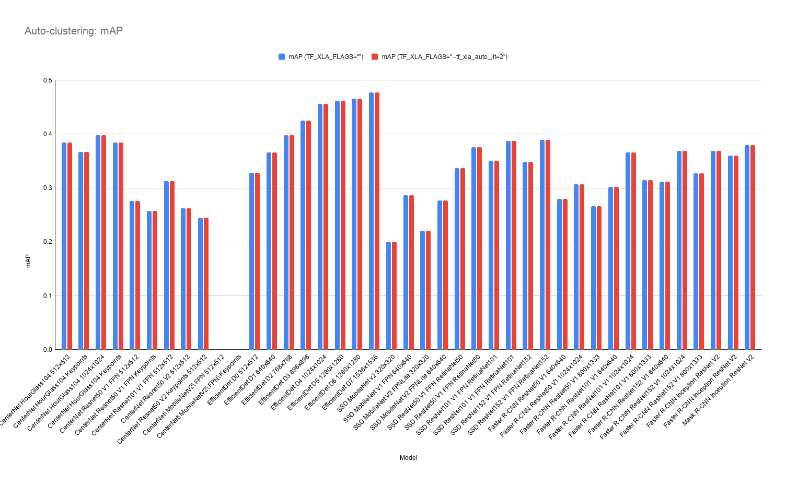
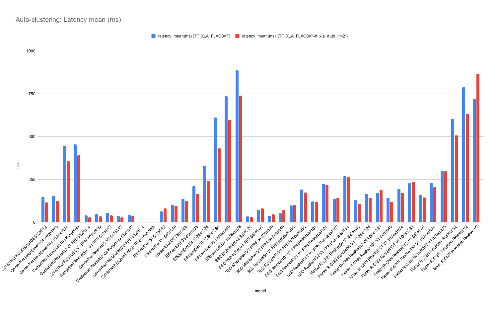

# TensorFlow 2 Detection Model Zoo Benchmarks

## Environment
    
- SW
    - OS: Fedora 33
    - TensorFlow: 2.4.1 (Build from source)
    - CUDA + cuDNN: 11.0 + 8.0
- HW
    - CPU: AMD Ryzen 7 1700 Eight-Core Processor
    - GPU: NVIDIA GeForce GTX 1070
    - MEM: 32GB

## Dataset
- [COCO2017](https://cocodataset.org/#home) 

## How to benchmarks

```
# Clone repository and install dependency.
$ git clone -b detection2 https://github.com/NobuoTsukamoto/tensorrt.git
$ cd tensorrt/tftrt/examples/object_detection
$ git submodule update --init
$ ./install_dependencies.sh
$ pip3 install jupyterlab

# Start jupyter lab and run.
$ jupyter lab
```

## Parameters
- Input batch size: 1
- [Auto-clustering](https://www.tensorflow.org/xla#auto-clustering)
    - [TF_XLA_FLAGS="" (No options)](benchmark_result.md#tf_xla_flags-no-options)
    - [TF_XLA_FLAGS="--tf_xla_auto_jit=2" (GPU)](benchmark_result.md#tf_xla_flags--tf_xla_auto_jit2)
    - [TF_XLA_FLAGS="--tf_xla_auto_jit=2 --tf_xla_cpu_global_jit" (GPU and CPU)](benchmark_result.md#tf_xla_flags--tf_xla_auto_jit2---tf_xla_cpu_global_jit)

## Results
- All results: 
    - [Local_TF2.4.1_GTX1070_CUDA11_TF_XLA_FLAGS_None.csv](./results/Local_TF2.4.1_GTX1070_CUDA11_TF_XLA_FLAGS_None.csv)
    - [Local_TF2.4.1_GTX1070_CUDA11_TF_XLA_FLAGS_GPU.csv](./results/Local_TF2.4.1_GTX1070_CUDA11_TF_XLA_FLAGS_GPU.csv)
    - [Local_TF2.4.1_GTX1070_CUDA11_TF_XLA_FLAGS_GPU_CPU.csv](./resultsLocal_TF2.4.1_GTX1070_CUDA11_TF_XLA_FLAGS_GPU_CPU.csv)
- Note: CenterNet MobileNetV2 (detection and keypoints) will result in an error inference by the saved model.


Result 
- [mAP](local_gtx1070.md#mAP)
- [latency](local_gtx1070.md#latency)

## mAP
| Model                               | Input     |   No option |   --tf_xla_auto_jit=2 |   --tf_xla_auto_jit=2 --tf_xla_cpu_global_jit  |
|:------------------------------------|:----------|------------:|----------------------:|-----------------------------------------------:|
| CenterNet HourGlass104              | 512x512   |       38.47 |                 38.47 |                                          38.47 |
| CenterNet HourGlass104 Keypoints    | 512x512   |       36.73 |                 36.73 |                                          36.73 |
| CenterNet HourGlass104              | 1024x1024 |       39.76 |                 39.76 |                                          39.76 |
| CenterNet HourGlass104 Keypoints    | 1024x1024 |       38.48 |                 38.48 |                                          38.48 |
| CenterNet Resnet50 V1 FPN           | 512x512   |       27.59 |                 27.59 |                                          27.59 |
| CenterNet Resnet50 V1 FPN Keypoints | 512x512   |       25.76 |                 25.76 |                                          25.76 |
| CenterNet Resnet101 V1 FPN          | 512x512   |       31.28 |                 31.28 |                                          31.28 |
| CenterNet Resnet50 V2               | 512x512   |       26.23 |                 26.23 |                                          26.23 |
| CenterNet Resnet50 V2 Keypoints     | 512x512   |       24.49 |                 24.49 |                                          24.49 |
| CenterNet MobileNetV2 FPN           | 512x512   |        0    |                  0    |                                           0    |
| CenterNet MobileNetV2 FPN Keypoints | 512x512   |        0    |                  0    |                                           0    |
| EfficientDet D0                     | 512x512   |       32.82 |                 32.82 |                                          32.82 |
| EfficientDet D1                     | 640x640   |       36.63 |                 36.63 |                                          36.63 |
| EfficientDet D2                     | 768x768   |       39.84 |                 39.84 |                                          39.84 |
| EfficientDet D3                     | 896x896   |       42.48 |                 42.48 |                                          42.48 |
| EfficientDet D4                     | 1024x1024 |       45.65 |                 45.65 |                                          45.65 |
| EfficientDet D5                     | 1280x1280 |       46.14 |                 46.14 |                                          46.14 |
| EfficientDet D6                     | 1280x1280 |       46.6  |                 46.6  |                                          46.6  |
| EfficientDet D7                     | 1536x1536 |       47.75 |                 47.75 |                                          47.75 |
| SSD MobileNet v2                    | 320x320   |       20.02 |                 20.02 |                                          20.02 |
| SSD MobileNet V1 FPN                | 640x640   |       28.67 |                 28.67 |                                          28.67 |
| SSD MobileNet V2 FPNLite            | 320x320   |       22.1  |                 22.1  |                                          22.1  |
| SSD MobileNet V2 FPNLite            | 640x640   |       27.69 |                 27.69 |                                          27.69 |
| SSD ResNet50 V1 FPN RetinaNet50     | 640x640   |       33.7  |                 33.7  |                                          33.7  |
| SSD ResNet50 V1 FPN RetinaNet50     | 1024x1024 |       37.58 |                 37.58 |                                          37.58 |
| SSD ResNet101 V1 FPN RetinaNet101   | 640x640   |       35.03 |                 35.03 |                                          35.03 |
| SSD ResNet101 V1 FPN RetinaNet101   | 1024x1024 |       38.76 |                 38.76 |                                          38.76 |
| SSD ResNet152 V1 FPN RetinaNet152   | 640x640   |       34.85 |                 34.85 |                                          34.85 |
| SSD ResNet152 V1 FPN RetinaNet152   | 1024x1024 |       38.9  |                 38.9  |                                          38.9  |
| Faster R-CNN ResNet50 V1            | 640x640   |       27.94 |                 27.94 |                                          27.94 |
| Faster R-CNN ResNet50 V1            | 1024x1024 |       30.66 |                 30.66 |                                          30.66 |
| Faster R-CNN ResNet50 V1            | 800x1333  |       26.66 |                 26.66 |                                          26.66 |
| Faster R-CNN ResNet101 V1           | 640x640   |       30.2  |                 30.2  |                                          30.2  |
| Faster R-CNN ResNet101 V1           | 1024x1024 |       36.56 |                 36.56 |                                          36.56 |
| Faster R-CNN ResNet101 V1           | 800x1333  |       31.45 |                 31.45 |                                          31.45 |
| Faster R-CNN ResNet152 V1           | 640x640   |       31.16 |                 31.16 |                                          31.16 |
| Faster R-CNN ResNet152 V1           | 1024x1024 |       36.86 |                 36.86 |                                          36.86 |
| Faster R-CNN ResNet152 V1           | 800x1333  |       32.75 |                 32.75 |                                          32.75 |
| Faster R-CNN Inception ResNet V2    | 640x640   |       36.89 |                 36.89 |                                          36.89 |
| Faster R-CNN Inception ResNet V2    | 1024x1024 |       36.02 |                 36.02 |                                          36.02 |
| Mask R-CNN Inception ResNet V2      | 1024x1024 |       37.94 |                 37.93 |                                          37.93 |



## latency
| Model                               | Input     |   No option |   --tf_xla_auto_jit=2 |   --tf_xla_auto_jit=2 --tf_xla_cpu_global_jit |
|:------------------------------------|:----------|------------:|----------------------:|----------------------------------------------:|
| CenterNet HourGlass104              | 512x512   |      147.56 |                116.43 |                                        118.76 |
| CenterNet HourGlass104 Keypoints    | 512x512   |      154.1  |                126.81 |                                        129.38 |
| CenterNet HourGlass104              | 1024x1024 |      446.5  |                355.56 |                                        371.37 |
| CenterNet HourGlass104 Keypoints    | 1024x1024 |      455.26 |                390.3  |                                        416.24 |
| CenterNet Resnet50 V1 FPN           | 512x512   |       40.04 |                 28.24 |                                         30.93 |
| CenterNet Resnet50 V1 FPN Keypoints | 512x512   |       47.46 |                 34.76 |                                         38.27 |
| CenterNet Resnet101 V1 FPN          | 512x512   |       56.2  |                 40.63 |                                         41.13 |
| CenterNet Resnet50 V2               | 512x512   |       37.51 |                 28.71 |                                         29.44 |
| CenterNet Resnet50 V2 Keypoints     | 512x512   |       43.97 |                 35.95 |                                         36.6  |
| CenterNet MobileNetV2 FPN           | 512x512   |        0    |                  0    |                                          0    |
| CenterNet MobileNetV2 FPN Keypoints | 512x512   |        0    |                  0    |                                          0    |
| EfficientDet D0                     | 512x512   |       64.84 |                 80.44 |                                         73.26 |
| EfficientDet D1                     | 640x640   |      100.28 |                 96.36 |                                         94.58 |
| EfficientDet D2                     | 768x768   |      137.33 |                124.28 |                                        125.84 |
| EfficientDet D3                     | 896x896   |      211.08 |                165.94 |                                        168.55 |
| EfficientDet D4                     | 1024x1024 |      331.26 |                242.75 |                                        242.21 |
| EfficientDet D5                     | 1280x1280 |      612.69 |                432.52 |                                        430.74 |
| EfficientDet D6                     | 1280x1280 |      735.09 |                596.63 |                                        596.36 |
| EfficientDet D7                     | 1536x1536 |      887.07 |                739    |                                        736.49 |
| SSD MobileNet v2                    | 320x320   |       34.78 |                 31.21 |                                         30.83 |
| SSD MobileNet V1 FPN                | 640x640   |       73.83 |                 82.02 |                                         81.64 |
| SSD MobileNet V2 FPNLite            | 320x320   |       39.12 |                 46.44 |                                         47.47 |
| SSD MobileNet V2 FPNLite            | 640x640   |       54.62 |                 71.11 |                                         71.55 |
| SSD ResNet50 V1 FPN RetinaNet50     | 640x640   |       98.22 |                103.24 |                                        103.31 |
| SSD ResNet50 V1 FPN RetinaNet50     | 1024x1024 |      192.47 |                174.71 |                                        174.47 |
| SSD ResNet101 V1 FPN RetinaNet101   | 640x640   |      121.58 |                120.26 |                                        121.1  |
| SSD ResNet101 V1 FPN RetinaNet101   | 1024x1024 |      225.05 |                218.02 |                                        218.5  |
| SSD ResNet152 V1 FPN RetinaNet152   | 640x640   |      137.32 |                142.77 |                                        144.29 |
| SSD ResNet152 V1 FPN RetinaNet152   | 1024x1024 |      269.25 |                264    |                                        263.72 |
| Faster R-CNN ResNet50 V1            | 640x640   |      131.86 |                108.85 |                                        109.4  |
| Faster R-CNN ResNet50 V1            | 1024x1024 |      163.83 |                144.25 |                                        143.82 |
| Faster R-CNN ResNet50 V1            | 800x1333  |      171.59 |                188.32 |                                        189.93 |
| Faster R-CNN ResNet101 V1           | 640x640   |      142.92 |                119.18 |                                        119.45 |
| Faster R-CNN ResNet101 V1           | 1024x1024 |      194.67 |                171.45 |                                        171.83 |
| Faster R-CNN ResNet101 V1           | 800x1333  |      227.84 |                236.79 |                                        236.61 |
| Faster R-CNN ResNet152 V1           | 640x640   |      159.81 |                144.47 |                                        146.35 |
| Faster R-CNN ResNet152 V1           | 1024x1024 |      229.89 |                204.62 |                                        204.66 |
| Faster R-CNN ResNet152 V1           | 800x1333  |      301.27 |                298.08 |                                        293.48 |
| Faster R-CNN Inception ResNet V2    | 640x640   |      603.5  |                507.29 |                                        503.55 |
| Faster R-CNN Inception ResNet V2    | 1024x1024 |      787.75 |                633.69 |                                        671.59 |
| Mask R-CNN Inception ResNet V2      | 1024x1024 |      720.34 |                867.56 |                                        833.71 |


