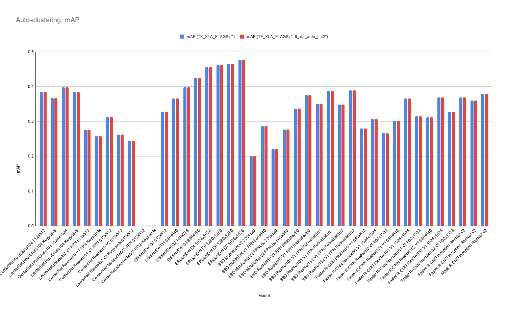
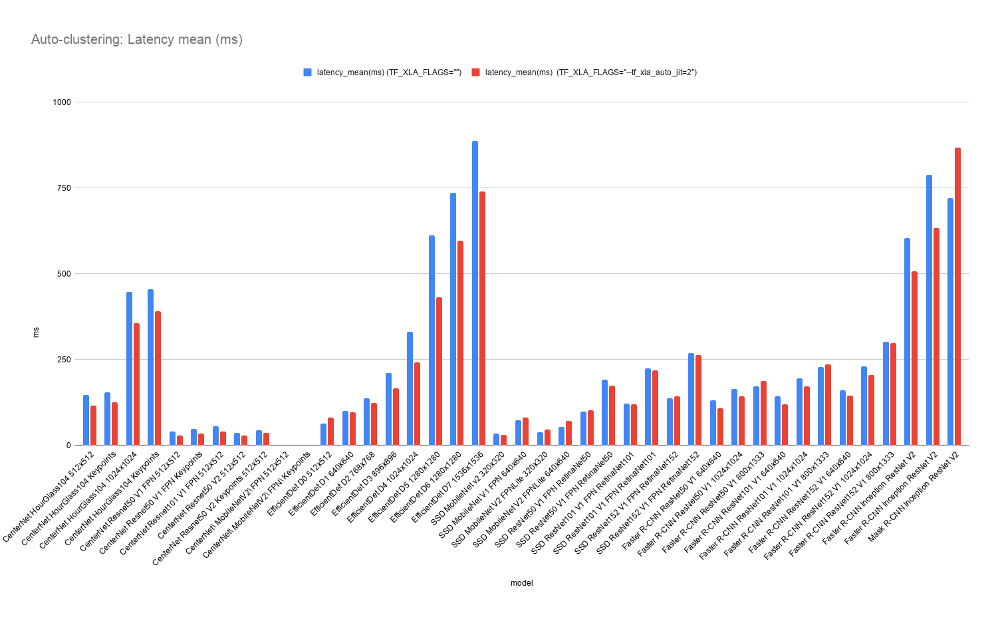

# TensorFlow 2 Detection Model Zoo Benchmarks

## Environment
    
- SW
    - OS: Fedora 33
    - TensorFlow: 2.4.1 (Build from source)
    - CUDA + cuDNN: 11.0 + 8.0
- HW
    - CPU: AMD Ryzen 7 1700 Eight-Core Processor
    - GPU: NVIDIA GeForce GTX 1070
    - MEM: 32GB

## Dataset
- [COCO2017](https://cocodataset.org/#home) 

## How to benchmarks

```
# Clone repository and install dependency.
$ git clone -b detection2 https://github.com/NobuoTsukamoto/tensorrt.git
$ cd tensorrt/tftrt/examples/object_detection
$ git submodule update --init
$ ./install_dependencies.sh
$ pip3 install jupyterlab

# Start jupyter lab and run.
$ jupyter lab
```

## Parameters
- [Auto-clustering](https://www.tensorflow.org/xla#auto-clustering)
    - [TF_XLA_FLAGS="" (No options)](benchmark_result.md#tf_xla_flags-no-options)
    - [TF_XLA_FLAGS="--tf_xla_auto_jit=2" (GPU)](benchmark_result.md#tf_xla_flags--tf_xla_auto_jit2)
    - [TF_XLA_FLAGS="--tf_xla_auto_jit=2 --tf_xla_cpu_global_jit" (GPU and CPU)](benchmark_result.md#tf_xla_flags--tf_xla_auto_jit2---tf_xla_cpu_global_jit)

## Results

Note: CenterNet MobileNetV2 (detection and keypoints) will result in an error inference by the saved model.

- Benchmark results
    - [TF_XLA_FLAGS="" (No options)](benchmark_result.md#tf_xla_flags-no-options)
    - [TF_XLA_FLAGS="--tf_xla_auto_jit=2" (GPU)](benchmark_result.md#tf_xla_flags--tf_xla_auto_jit2)
    - [TF_XLA_FLAGS="--tf_xla_auto_jit=2 --tf_xla_cpu_global_jit" (GPU and CPU)](benchmark_result.md#tf_xla_flags--tf_xla_auto_jit2---tf_xla_cpu_global_jit)
- Comparison of Auto-clustering
    - [mAP (None vs GPU)](benchmark_result.md#map-none-vs-gpu)
    - [Latency mean (ms) (None vs GPU)](benchmark_result.md#latency-mean-ms-none-vs-gpu)

### TF_XLA_FLAGS="" (No options)
| Model                               | Input     | TF-TRT      |    AP |   AP50 |   AP75 |   APsmall |   APmedium |   APlarge |   ARmax=1 |   ARmax=10 |   ARmax=100 |   ARsmall |   ARmidium |   ARlarge |   images/sec |   99th_percentile(ms) |   total_time(s) |   latency_mean(ms) |   latency_median(ms) |   latency_min(ms) |
|:------------------------------------|:----------|:------------|------:|-------:|-------:|----------:|-----------:|----------:|----------:|-----------:|------------:|----------:|-----------:|----------:|-------------:|----------------------:|----------------:|-------------------:|---------------------:|------------------:|
| CenterNet HourGlass104              | 512x512   | Native FP32 | 38.47 |  56.41 |  41.16 |     19.82 |      42.5  |     52.74 |     32.48 |      52.7  |       55.59 |     33.27 |      60.56 |     74.12 |         6.8  |                172.58 |          730.4  |             147.56 |               143.55 |            133.68 |
| CenterNet HourGlass104 Keypoints    | 512x512   | Native FP32 | 36.73 |  54.6  |  38.91 |     18.23 |      40.34 |     51.14 |     31.32 |      50.6  |       53.34 |     31.41 |      57.42 |     72.56 |         6.49 |                175.28 |          762.8  |             154.1  |               153.14 |            143.6  |
| CenterNet HourGlass104              | 1024x1024 | Native FP32 | 39.76 |  56.45 |  43.57 |     24.72 |      43.93 |     51.35 |     33.63 |      55.84 |       59.65 |     40.48 |      63.34 |     75.56 |         2.25 |                502.48 |         2210.2  |             446.5  |               441.56 |            408.47 |
| CenterNet HourGlass104 Keypoints    | 1024x1024 | Native FP32 | 38.48 |  55.13 |  42.04 |     22.9  |      42.2  |     51.3  |     32.89 |      54.22 |       57.81 |     38.5  |      61.51 |     74.07 |         2.2  |                507.33 |         2253.55 |             455.26 |               453.77 |            436.4  |
| CenterNet Resnet50 V1 FPN           | 512x512   | Native FP32 | 27.59 |  43.75 |  29.12 |     11.66 |      32.51 |     40.57 |     26.98 |      43.34 |       45.45 |     22.95 |      49.26 |     64.83 |        24.98 |                 42.46 |          198.21 |              40.04 |                39.72 |             38.15 |
| CenterNet Resnet50 V1 FPN Keypoints | 512x512   | Native FP32 | 25.76 |  42.1  |  27.3  |     10.99 |      29.61 |     38.34 |     25.52 |      41.16 |       43.09 |     21.74 |      46.71 |     61.28 |        21.09 |                 50.74 |          234.93 |              47.46 |                47.25 |             43.03 |
| CenterNet Resnet101 V1 FPN          | 512x512   | Native FP32 | 31.28 |  47.88 |  33.01 |     12.09 |      34.92 |     46.71 |     29.12 |      45.41 |       47.26 |     22.93 |      50.61 |     69.23 |        17.8  |                 59.37 |          278.19 |              56.2  |                55.92 |             53.23 |
| CenterNet Resnet50 V2               | 512x512   | Native FP32 | 26.23 |  41.57 |  27.76 |      9.95 |      31.54 |     39.23 |     26.33 |      41.44 |       43.27 |     18.34 |      47.59 |     65.32 |        26.67 |                 40.09 |          185.68 |              37.51 |                37.19 |             35.8  |
| CenterNet Resnet50 V2 Keypoints     | 512x512   | Native FP32 | 24.49 |  40.07 |  25.59 |      9    |      28.97 |     38.17 |     25.04 |      39.55 |       41.2  |     17.64 |      45.14 |     63    |        22.77 |                 47.57 |          217.65 |              43.97 |                43.79 |             39.88 |
| CenterNet MobileNetV2 FPN           | 512x512   | FP32        |  0    |   0    |   0    |      0    |       0    |      0    |      0    |       0    |        0    |      0    |       0    |      0    |         0    |                  0    |            0    |               0    |                 0    |              0    |
| CenterNet MobileNetV2 FPN Keypoints | 512x512   | FP32        |  0    |   0    |   0    |      0    |       0    |      0    |      0    |       0    |        0    |      0    |       0    |      0    |         0    |                  0    |            0    |               0    |                 0    |              0    |
| EfficientDet D0                     | 512x512   | Native FP32 | 32.82 |  51.62 |  34.42 |     14.35 |      36.89 |     50.22 |     28.68 |      44.11 |       46.87 |     23.16 |      53.19 |     67.98 |        15.55 |                 82.78 |          320.94 |              64.84 |                63.63 |             51.74 |
| EfficientDet D1                     | 640x640   | Native FP32 | 36.63 |  56    |  38.81 |     16.97 |      40.65 |     54.31 |     30.96 |      48.21 |       51.23 |     27.8  |      56.65 |     71.38 |        10.01 |                117.11 |          496.4  |             100.28 |                99.55 |             85.41 |
| EfficientDet D2                     | 768x768   | Native FP32 | 39.84 |  59.45 |  42.39 |     20.98 |      44.41 |     56.1  |     33.2  |      51.74 |       55.07 |     33.64 |      60.15 |     73.92 |         7.3  |                155.61 |          679.76 |             137.33 |               136.56 |            120.49 |
| EfficientDet D3                     | 896x896   | Native FP32 | 42.48 |  62.19 |  45.4  |     24.76 |      46.36 |     58.35 |     34.12 |      54.34 |       57.81 |     37.31 |      62.58 |     75.01 |         4.74 |                233.55 |         1044.84 |             211.08 |               210.31 |            192.27 |
| EfficientDet D4                     | 1024x1024 | Native FP32 | 45.65 |  66.27 |  48.98 |     29.17 |      50.01 |     61.53 |     35.69 |      56.93 |       60.54 |     43.06 |      65.12 |     76.9  |         3.02 |                358.02 |         1639.74 |             331.26 |               330.49 |            306.76 |
| EfficientDet D5                     | 1280x1280 | Native FP32 | 46.14 |  66.64 |  49.74 |     29.63 |      50.64 |     60.81 |     35.91 |      58.2  |       61.9  |     44.3  |      66.39 |     77.17 |         1.63 |                649.52 |         3032.79 |             612.69 |               611.12 |            587.53 |
| EfficientDet D6                     | 1280x1280 | Native FP32 | 46.6  |  67.04 |  50.19 |     31.29 |      51.49 |     60.33 |     36.24 |      58.82 |       62.55 |     45.85 |      67.05 |     77.61 |         1.36 |                781.77 |         3638.72 |             735.09 |               732.77 |            705.75 |
| EfficientDet D7                     | 1536x1536 | Native FP32 | 47.75 |  68.14 |  51.19 |     31.74 |      52.07 |     62.86 |     36.72 |      59.43 |       63.17 |     46.49 |      67.6  |     78.71 |         1.13 |                926.06 |         4390.98 |             887.07 |               885.68 |            855.67 |
| SSD MobileNet v2                    | 320x320   | Native FP32 | 20.02 |  34.55 |  19.91 |      2.3  |      17.24 |     41.34 |     21.25 |      32.51 |       34.44 |      6.86 |      35.13 |     65.43 |        28.99 |                 41.2  |          172.18 |              34.78 |                35.27 |             21.99 |
| SSD MobileNet V1 FPN                | 640x640   | Native FP32 | 28.67 |  46.11 |  30.52 |     13.14 |      31.25 |     41.51 |     26.83 |      43.38 |       46.85 |     23.85 |      51.03 |     66.22 |        13.58 |                 83.17 |          365.44 |              73.83 |                73.67 |             62.06 |
| SSD MobileNet V2 FPNLite            | 320x320   | Native FP32 | 22.1  |  37.25 |  22.81 |      5.12 |      23.39 |     38.49 |     21.77 |      33.62 |       36.22 |      7.77 |      41.81 |     60.83 |        26.06 |                 47.92 |          193.64 |              39.12 |                41.1  |             25.6  |
| SSD MobileNet V2 FPNLite            | 640x640   | Native FP32 | 27.69 |  46.1  |  29.15 |     11.51 |      30.39 |     41.05 |     25.45 |      40.67 |       43.85 |     21.21 |      48.31 |     62.72 |        18.37 |                 63.27 |          270.36 |              54.62 |                54.23 |             46.81 |
| SSD ResNet50 V1 FPN RetinaNet50     | 640x640   | Native FP32 | 33.7  |  51.8  |  36.63 |     15.52 |      37.06 |     49.51 |     29.89 |      47.37 |       50.94 |     27.28 |      55.93 |     71.63 |        10.21 |                111.61 |          486.17 |              98.22 |                97.92 |             85.32 |
| SSD ResNet50 V1 FPN RetinaNet50     | 1024x1024 | Native FP32 | 37.58 |  56.95 |  40.29 |     19.71 |      41.18 |     50.87 |     32    |      51.43 |       54.98 |     33.85 |      58.33 |     72.7  |         5.21 |                215.41 |          952.74 |             192.47 |               192.87 |            168.74 |
| SSD ResNet101 V1 FPN RetinaNet101   | 640x640   | Native FP32 | 35.03 |  53.18 |  38.11 |     16.12 |      39.12 |     50.85 |     30.6  |      48.47 |       51.94 |     28.01 |      56.96 |     72.62 |         8.24 |                136.66 |          601.84 |             121.58 |               121.27 |            100.04 |
| SSD ResNet101 V1 FPN RetinaNet101   | 1024x1024 | Native FP32 | 38.76 |  58.03 |  42.08 |     20.6  |      42.45 |     53.08 |     32.55 |      52.15 |       55.64 |     34.37 |      59.74 |     73.98 |         4.45 |                239.88 |         1113.98 |             225.05 |               224.16 |            204.76 |
| SSD ResNet152 V1 FPN RetinaNet152   | 640x640   | Native FP32 | 34.85 |  52.83 |  37.66 |     15.82 |      38.55 |     51.02 |     30.4  |      48.06 |       51.62 |     27.73 |      57.25 |     71.76 |         7.29 |                148    |          679.72 |             137.32 |               137.16 |            124.19 |
| SSD ResNet152 V1 FPN RetinaNet152   | 1024x1024 | Native FP32 | 38.9  |  58.12 |  42.1  |     20.66 |      42.53 |     53.18 |     32.61 |      52.14 |       55.8  |     34.02 |      59.82 |     74.04 |         3.72 |                284.93 |         1332.77 |             269.25 |               268.32 |            245.94 |
| Faster R-CNN ResNet50 V1            | 640x640   | Native FP32 | 27.94 |  45.81 |  29.32 |      9.3  |      30.66 |     45.27 |     26.6  |      41.96 |       44.8  |     19.99 |      49.65 |     69.09 |         7.6  |                142.23 |          652.72 |             131.86 |               132.55 |            116.83 |
| Faster R-CNN ResNet50 V1            | 1024x1024 | Native FP32 | 30.66 |  50.12 |  31.9  |     14.25 |      36.84 |     44.42 |     27.82 |      45.22 |       48.63 |     28.41 |      55.2  |     67.01 |         6.12 |                183.63 |          810.95 |             163.83 |               163.5  |            142.19 |
| Faster R-CNN ResNet50 V1            | 800x1333  | Native FP32 | 26.66 |  45.75 |  27.14 |     15.55 |      33.24 |     35.05 |     24.45 |      41.39 |       43.61 |     26.82 |      49.03 |     58.3  |         5.84 |                186.49 |          849.36 |             171.59 |               171.94 |            150.65 |
| Faster R-CNN ResNet101 V1           | 640x640   | Native FP32 | 30.2  |  48.11 |  31.75 |     10.36 |      33.2  |     47.35 |     28.1  |      43.72 |       46.49 |     21.79 |      51.78 |     69.15 |         7    |                153.71 |          707.46 |             142.92 |               142.86 |            129.56 |
| Faster R-CNN ResNet101 V1           | 1024x1024 | Native FP32 | 36.56 |  55.94 |  38.88 |     17.59 |      40.82 |     53.95 |     31.98 |      50.45 |       53.91 |     33.18 |      58.53 |     73.96 |         5.15 |                212.79 |          963.64 |             194.67 |               194.31 |            174.79 |
| Faster R-CNN ResNet101 V1           | 800x1333  | Native FP32 | 31.45 |  51.15 |  32.73 |     16.43 |      37.06 |     41.5  |     27.18 |      45.39 |       47.85 |     28.39 |      53.6  |     63.29 |         4.39 |                242.39 |         1127.8  |             227.84 |               228.09 |            206.92 |
| Faster R-CNN ResNet152 V1           | 640x640   | Native FP32 | 31.16 |  49.03 |  32.74 |     10.89 |      34.36 |     49.49 |     28.71 |      44.8  |       47.77 |     22.93 |      53.25 |     70.31 |         6.26 |                171.27 |          791.04 |             159.81 |               159.58 |            147.19 |
| Faster R-CNN ResNet152 V1           | 1024x1024 | Native FP32 | 36.86 |  55.72 |  39.19 |     16.9  |      41.38 |     54.49 |     32.52 |      51.19 |       54.65 |     33.01 |      59.42 |     74.58 |         4.35 |                247.4  |         1137.93 |             229.89 |               229.46 |            211.67 |
| Faster R-CNN ResNet152 V1           | 800x1333  | Native FP32 | 32.75 |  52.31 |  34.77 |     17.26 |      37.86 |     43.73 |     28.36 |      46.5  |       48.88 |     29.89 |      54.22 |     64.48 |         3.33 |                347.8  |         1491.3  |             301.27 |               292.1  |            266.74 |
| Faster R-CNN Inception ResNet V2    | 640x640   | Native FP32 | 36.89 |  56.15 |  38.83 |     15.38 |      41.3  |     55.93 |     31.79 |      49.11 |       51.53 |     26.9  |      57.05 |     73.97 |         1.66 |                640.77 |         2987.3  |             603.5  |               600.49 |            582.5  |
| Faster R-CNN Inception ResNet V2    | 1024x1024 | Native FP32 | 36.02 |  57.33 |  37.88 |     16.47 |      40.47 |     52.54 |     30.98 |      47.99 |       50.5  |     28.83 |      55.43 |     69.82 |         1.28 |                873.24 |         3899.38 |             787.75 |               805.92 |            681.13 |
| Mask R-CNN Inception ResNet V2      | 1024x1024 | Native FP32 | 37.94 |  59.16 |  40.59 |     18.71 |      42.27 |     53.82 |     31.86 |      49.76 |       52.28 |     31.16 |      57.22 |     71.04 |         1.41 |               1100.1  |         3565.66 |             720.34 |               708.34 |            616.83 |

### TF_XLA_FLAGS="--tf_xla_auto_jit=2"
| Model                               | Input     | TF-TRT      |    AP |   AP50 |   AP75 |   APsmall |   APmedium |   APlarge |   ARmax=1 |   ARmax=10 |   ARmax=100 |   ARsmall |   ARmidium |   ARlarge |   images/sec |   99th_percentile(ms) |   total_time(s) |   latency_mean(ms) |   latency_median(ms) |   latency_min(ms) |
|:------------------------------------|:----------|:------------|------:|-------:|-------:|----------:|-----------:|----------:|----------:|-----------:|------------:|----------:|-----------:|----------:|-------------:|----------------------:|----------------:|-------------------:|---------------------:|------------------:|
| CenterNet HourGlass104              | 512x512   | Native FP32 | 38.47 |  56.41 |  41.16 |     19.82 |      42.5  |     52.74 |     32.48 |      52.7  |       55.59 |     33.27 |      60.56 |     74.12 |         8.59 |                126.66 |          576.32 |             116.43 |               115.23 |            112.05 |
| CenterNet HourGlass104 Keypoints    | 512x512   | Native FP32 | 36.73 |  54.6  |  38.91 |     18.23 |      40.34 |     51.14 |     31.32 |      50.6  |       53.34 |     31.41 |      57.42 |     72.56 |         7.9  |                131.5  |          627.72 |             126.81 |               126.95 |            120.73 |
| CenterNet HourGlass104              | 1024x1024 | Native FP32 | 39.76 |  56.45 |  43.57 |     24.72 |      43.93 |     51.35 |     33.63 |      55.84 |       59.65 |     40.48 |      63.34 |     75.56 |         2.81 |                362.29 |         1760.01 |             355.56 |               355.41 |            346.19 |
| CenterNet HourGlass104 Keypoints    | 1024x1024 | Native FP32 | 38.48 |  55.13 |  42.04 |     22.9  |      42.2  |     51.3  |     32.89 |      54.22 |       57.81 |     38.5  |      61.51 |     74.07 |         2.56 |                398.25 |         1932    |             390.3  |               390.42 |            379.15 |
| CenterNet Resnet50 V1 FPN           | 512x512   | Native FP32 | 27.59 |  43.75 |  29.12 |     11.66 |      32.51 |     40.57 |     26.98 |      43.34 |       45.45 |     22.95 |      49.26 |     64.83 |        35.42 |                 29.22 |          139.77 |              28.24 |                28.19 |             27.32 |
| CenterNet Resnet50 V1 FPN Keypoints | 512x512   | Native FP32 | 25.76 |  42.1  |  27.3  |     10.99 |      29.61 |     38.34 |     25.52 |      41.16 |       43.09 |     21.74 |      46.71 |     61.28 |        28.84 |                 37.3  |          172.07 |              34.76 |                35.78 |             30.88 |
| CenterNet Resnet101 V1 FPN          | 512x512   | Native FP32 | 31.28 |  47.88 |  33.01 |     12.09 |      34.92 |     46.71 |     29.12 |      45.41 |       47.26 |     22.93 |      50.61 |     69.23 |        24.62 |                 42.62 |          201.11 |              40.63 |                40.56 |             38.74 |
| CenterNet Resnet50 V2               | 512x512   | Native FP32 | 26.23 |  41.57 |  27.76 |      9.95 |      31.54 |     39.23 |     26.33 |      41.44 |       43.27 |     18.34 |      47.59 |     65.32 |        34.84 |                 30.06 |          142.1  |              28.71 |                28.65 |             27.99 |
| CenterNet Resnet50 V2 Keypoints     | 512x512   | Native FP32 | 24.49 |  40.07 |  25.59 |      9    |      28.97 |     38.17 |     25.04 |      39.55 |       41.2  |     17.64 |      45.14 |     63    |        27.89 |                 38.63 |          177.96 |              35.95 |                37.04 |             32.48 |
| CenterNet MobileNetV2 FPN           | 512x512   | Native FP32 |  0    |   0    |   0    |      0    |       0    |      0    |      0    |       0    |        0    |      0    |       0    |      0    |         0    |                  0    |            0    |               0    |                 0    |              0    |
| CenterNet MobileNetV2 FPN Keypoints | 512x512   | Native FP32 |  0    |   0    |   0    |      0    |       0    |      0    |      0    |       0    |        0    |      0    |       0    |      0    |         0    |                  0    |            0    |               0    |                 0    |              0    |
| EfficientDet D0                     | 512x512   | Native FP32 | 32.82 |  51.62 |  34.42 |     14.35 |      36.89 |     50.22 |     28.68 |      44.11 |       46.87 |     23.16 |      53.19 |     67.98 |        12.68 |                100.42 |          398.19 |              80.44 |                79.84 |             50.9  |
| EfficientDet D1                     | 640x640   | Native FP32 | 36.63 |  56    |  38.81 |     16.97 |      40.65 |     54.31 |     30.96 |      48.21 |       51.23 |     27.8  |      56.65 |     71.38 |        10.5  |                116.32 |          477    |              96.36 |                95.69 |             72.61 |
| EfficientDet D2                     | 768x768   | Native FP32 | 39.84 |  59.45 |  42.39 |     20.98 |      44.41 |     56.1  |     33.2  |      51.74 |       55.07 |     33.64 |      60.15 |     73.92 |         8.23 |                137.11 |          615.17 |             124.28 |               121.69 |            100.41 |
| EfficientDet D3                     | 896x896   | Native FP32 | 42.48 |  62.19 |  45.4  |     24.76 |      46.36 |     58.35 |     34.12 |      54.34 |       57.81 |     37.31 |      62.58 |     75.01 |         6.14 |                177.89 |          821.4  |             165.94 |               162.79 |            141.64 |
| EfficientDet D4                     | 1024x1024 | Native FP32 | 45.65 |  66.27 |  48.98 |     29.17 |      50.01 |     61.53 |     35.69 |      56.93 |       60.54 |     43.06 |      65.12 |     76.9  |         4.13 |                259.04 |         1201.6  |             242.75 |               242.08 |            220.26 |
| EfficientDet D5                     | 1280x1280 | Native FP32 | 46.14 |  66.64 |  49.74 |     29.63 |      50.64 |     60.81 |     35.91 |      58.2  |       61.9  |     44.3  |      66.39 |     77.17 |         2.32 |                451.91 |         2140.99 |             432.52 |               431.42 |            405.28 |
| EfficientDet D6                     | 1280x1280 | Native FP32 | 46.6  |  67.04 |  50.19 |     31.29 |      51.49 |     60.33 |     36.24 |      58.82 |       62.55 |     45.85 |      67.05 |     77.61 |         1.68 |                617.68 |         2953.34 |             596.63 |               595.86 |            561.77 |
| EfficientDet D7                     | 1536x1536 | Native FP32 | 47.75 |  68.14 |  51.19 |     31.74 |      52.07 |     62.86 |     36.72 |      59.43 |       63.17 |     46.49 |      67.6  |     78.71 |         1.36 |                760.45 |         3658.06 |             739    |               733.86 |            696.81 |
| SSD MobileNet v2                    | 320x320   | Native FP32 | 20.02 |  34.55 |  19.91 |      2.3  |      17.24 |     41.34 |     21.25 |      32.51 |       34.44 |      6.86 |      35.13 |     65.43 |        34.06 |                 32.8  |          154.51 |              31.21 |                29.34 |             20.87 |
| SSD MobileNet V1 FPN                | 640x640   | Native FP32 | 28.67 |  46.11 |  30.52 |     13.14 |      31.25 |     41.51 |     26.83 |      43.38 |       46.85 |     23.85 |      51.03 |     66.22 |        13.03 |                 90.48 |          406.01 |              82.02 |                77    |             62.56 |
| SSD MobileNet V2 FPNLite            | 320x320   | Native FP32 | 22.1  |  37.25 |  22.81 |      5.12 |      23.39 |     38.49 |     21.77 |      33.62 |       36.22 |      7.77 |      41.81 |     60.83 |        27.38 |                 43.59 |          229.88 |              46.44 |                37.6  |             24.03 |
| SSD MobileNet V2 FPNLite            | 640x640   | Native FP32 | 27.69 |  46.1  |  29.15 |     11.51 |      30.39 |     41.05 |     25.45 |      40.67 |       43.85 |     21.21 |      48.31 |     62.72 |        17.18 |                 71.53 |          351.98 |              71.11 |                58.42 |             46.54 |
| SSD ResNet50 V1 FPN RetinaNet50     | 640x640   | Native FP32 | 33.7  |  51.8  |  36.63 |     15.52 |      37.06 |     49.51 |     29.89 |      47.37 |       50.94 |     27.28 |      55.93 |     71.63 |        10.59 |                104.8  |          511.04 |             103.24 |                94.3  |             79.41 |
| SSD ResNet50 V1 FPN RetinaNet50     | 1024x1024 | Native FP32 | 37.58 |  56.95 |  40.29 |     19.71 |      41.18 |     50.87 |     32    |      51.43 |       54.98 |     33.85 |      58.33 |     72.7  |         5.73 |                190.93 |          864.81 |             174.71 |               173.37 |            156.9  |
| SSD ResNet101 V1 FPN RetinaNet101   | 640x640   | Native FP32 | 35.03 |  53.18 |  38.11 |     16.12 |      39.12 |     50.85 |     30.6  |      48.47 |       51.94 |     28.01 |      56.96 |     72.62 |         8.77 |                123.85 |          595.3  |             120.26 |               113.91 |             98.75 |
| SSD ResNet101 V1 FPN RetinaNet101   | 1024x1024 | Native FP32 | 38.76 |  58.03 |  42.08 |     20.6  |      42.45 |     53.08 |     32.55 |      52.15 |       55.64 |     34.37 |      59.74 |     73.98 |         4.59 |                235.11 |         1079.2  |             218.02 |               216.9  |            198.58 |
| SSD ResNet152 V1 FPN RetinaNet152   | 640x640   | Native FP32 | 34.85 |  52.83 |  37.66 |     15.82 |      38.55 |     51.02 |     30.4  |      48.06 |       51.62 |     27.73 |      57.25 |     71.76 |         7.46 |                145.21 |          706.73 |             142.77 |               133.76 |            118.6  |
| SSD ResNet152 V1 FPN RetinaNet152   | 1024x1024 | Native FP32 | 38.9  |  58.12 |  42.1  |     20.66 |      42.53 |     53.18 |     32.61 |      52.14 |       55.8  |     34.02 |      59.82 |     74.04 |         3.79 |                281.11 |         1306.81 |             264    |               263.24 |            244.2  |
| Faster R-CNN ResNet50 V1            | 640x640   | Native FP32 | 27.94 |  45.81 |  29.32 |      9.3  |      30.66 |     45.27 |     26.6  |      41.96 |       44.8  |     19.99 |      49.65 |     69.09 |         9.92 |                124.37 |          538.83 |             108.85 |                95.88 |             78.36 |
| Faster R-CNN ResNet50 V1            | 1024x1024 | Native FP32 | 30.66 |  50.12 |  31.9  |     14.25 |      36.84 |     44.42 |     27.82 |      45.22 |       48.63 |     28.41 |      55.2  |     67.01 |         7.44 |                163.66 |          714.04 |             144.25 |               142.46 |            102.75 |
| Faster R-CNN ResNet50 V1            | 800x1333  | Native FP32 | 26.66 |  45.76 |  27.14 |     15.55 |      33.24 |     35.05 |     24.45 |      41.39 |       43.61 |     26.82 |      49.03 |     58.3  |         5.69 |                201.7  |          932.17 |             188.32 |               182.83 |            142.17 |
| Faster R-CNN ResNet101 V1           | 640x640   | Native FP32 | 30.2  |  48.11 |  31.75 |     10.36 |      33.2  |     47.35 |     28.1  |      43.72 |       46.49 |     21.79 |      51.78 |     69.15 |         9.13 |                136.5  |          589.93 |             119.18 |               104.43 |             93.31 |
| Faster R-CNN ResNet101 V1           | 1024x1024 | Native FP32 | 36.56 |  55.94 |  38.88 |     17.59 |      40.82 |     53.95 |     31.98 |      50.45 |       53.91 |     33.18 |      58.53 |     73.96 |         6.15 |                192.38 |          848.7  |             171.45 |               159.65 |            136.87 |
| Faster R-CNN ResNet101 V1           | 800x1333  | Native FP32 | 31.45 |  51.15 |  32.73 |     16.43 |      37.06 |     41.5  |     27.18 |      45.39 |       47.85 |     28.39 |      53.6  |     63.29 |         4.34 |                252.57 |         1172.12 |             236.79 |               237.41 |            199.16 |
| Faster R-CNN ResNet152 V1           | 640x640   | Native FP32 | 31.16 |  49.03 |  32.74 |     10.89 |      34.36 |     49.49 |     28.7  |      44.8  |       47.77 |     22.93 |      53.25 |     70.31 |         8.01 |                154.51 |          715.1  |             144.47 |               119.69 |            109.49 |
| Faster R-CNN ResNet152 V1           | 1024x1024 | Native FP32 | 36.86 |  55.72 |  39.19 |     16.9  |      41.38 |     54.49 |     32.52 |      51.19 |       54.65 |     33.01 |      59.42 |     74.58 |         5.08 |                226.81 |         1012.85 |             204.62 |               191.37 |            172.78 |
| Faster R-CNN ResNet152 V1           | 800x1333  | Native FP32 | 32.75 |  52.31 |  34.77 |     17.26 |      37.86 |     43.73 |     28.36 |      46.5  |       48.88 |     29.89 |      54.22 |     64.48 |         3.43 |                346.07 |         1475.51 |             298.08 |               295.16 |            256.38 |
| Faster R-CNN Inception ResNet V2    | 640x640   | Native FP32 | 36.89 |  56.15 |  38.83 |     15.38 |      41.3  |     55.93 |     31.79 |      49.11 |       51.53 |     26.9  |      57.05 |     73.97 |         2.01 |                610.87 |         2511.09 |             507.29 |               484.35 |            465.83 |
| Faster R-CNN Inception ResNet V2    | 1024x1024 | Native FP32 | 36.02 |  57.33 |  37.88 |     16.47 |      40.47 |     52.54 |     30.98 |      47.99 |       50.5  |     28.83 |      55.43 |     69.82 |         1.59 |                755.64 |         3136.78 |             633.69 |               621.7  |            585.79 |
| Mask R-CNN Inception ResNet V2      | 1024x1024 | Native FP32 | 37.93 |  59.16 |  40.59 |     18.71 |      42.27 |     53.83 |     31.87 |      49.76 |       52.28 |     31.16 |      57.22 |     71.05 |         1.17 |                978.82 |         4294.42 |             867.56 |               851    |            778.82 |

### TF_XLA_FLAGS="--tf_xla_auto_jit=2 --tf_xla_cpu_global_jit"
| Model                               | Input     | TF-TRT      |    AP |   AP50 |   AP75 |   APsmall |   APmedium |   APlarge |   ARmax=1 |   ARmax=10 |   ARmax=100 |   ARsmall |   ARmidium |   ARlarge |   images/sec |   99th_percentile(ms) |   total_time(s) |   latency_mean(ms) |   latency_median(ms) |   latency_min(ms) |
|:------------------------------------|:----------|:------------|------:|-------:|-------:|----------:|-----------:|----------:|----------:|-----------:|------------:|----------:|-----------:|----------:|-------------:|----------------------:|----------------:|-------------------:|---------------------:|------------------:|
| CenterNet HourGlass104              | 512x512   | Native FP32 | 38.47 |  56.41 |  41.16 |     19.82 |      42.5  |     52.74 |     32.48 |      52.7  |       55.59 |     33.27 |      60.56 |     74.12 |         8.42 |                126.04 |          587.88 |             118.76 |               118.56 |            114.3  |
| CenterNet HourGlass104 Keypoints    | 512x512   | Native FP32 | 36.73 |  54.6  |  38.91 |     18.23 |      40.34 |     51.14 |     31.32 |      50.6  |       53.34 |     31.41 |      57.42 |     72.56 |         7.74 |                134.09 |          640.46 |             129.38 |               129.39 |            122.47 |
| CenterNet HourGlass104              | 1024x1024 | Native FP32 | 39.76 |  56.45 |  43.57 |     24.72 |      43.93 |     51.35 |     33.63 |      55.84 |       59.65 |     40.48 |      63.34 |     75.56 |         2.7  |                439.87 |         1838.29 |             371.37 |               367.2  |            351.7  |
| CenterNet HourGlass104 Keypoints    | 1024x1024 | Native FP32 | 38.48 |  55.13 |  42.04 |     22.9  |      42.2  |     51.3  |     32.89 |      54.22 |       57.81 |     38.5  |      61.51 |     74.07 |         2.41 |                483.09 |         2060.37 |             416.24 |               404.68 |            390.17 |
| CenterNet Resnet50 V1 FPN           | 512x512   | Native FP32 | 27.59 |  43.75 |  29.12 |     11.66 |      32.51 |     40.57 |     26.98 |      43.34 |       45.45 |     22.95 |      49.26 |     64.83 |        32.36 |                 33.7  |          153.12 |              30.93 |                30.89 |             27.62 |
| CenterNet Resnet50 V1 FPN Keypoints | 512x512   | Native FP32 | 25.76 |  42.1  |  27.3  |     10.99 |      29.61 |     38.34 |     25.52 |      41.16 |       43.09 |     21.74 |      46.71 |     61.28 |        26.25 |                 44.45 |          189.44 |              38.27 |                38.34 |             31.17 |
| CenterNet Resnet101 V1 FPN          | 512x512   | Native FP32 | 31.28 |  47.88 |  33.01 |     12.09 |      34.92 |     46.71 |     29.12 |      45.41 |       47.26 |     22.93 |      50.61 |     69.23 |        24.33 |                 44.09 |          203.59 |              41.13 |                40.8  |             38.79 |
| CenterNet Resnet50 V2               | 512x512   | Native FP32 | 26.23 |  41.57 |  27.76 |      9.95 |      31.54 |     39.23 |     26.33 |      41.44 |       43.27 |     18.34 |      47.59 |     65.32 |        33.98 |                 31.62 |          145.75 |              29.44 |                29.18 |             28.2  |
| CenterNet Resnet50 V2 Keypoints     | 512x512   | Native FP32 | 24.49 |  40.07 |  25.59 |      9    |      28.97 |     38.17 |     25.04 |      39.55 |       41.2  |     17.64 |      45.14 |     63    |        27.41 |                 40.44 |          181.16 |              36.6  |                37.27 |             32.52 |
| CenterNet MobileNetV2 FPN           | 512x512   | Native FP32 |  0    |   0    |   0    |      0    |       0    |      0    |      0    |       0    |        0    |      0    |       0    |      0    |         0    |                  0    |            0    |               0    |                 0    |              0    |
| CenterNet MobileNetV2 FPN Keypoints | 512x512   | Native FP32 |  0    |   0    |   0    |      0    |       0    |      0    |      0    |       0    |        0    |      0    |       0    |      0    |         0    |                  0    |            0    |               0    |                 0    |              0    |
| EfficientDet D0                     | 512x512   | Native FP32 | 32.82 |  51.62 |  34.42 |     14.35 |      36.89 |     50.22 |     28.68 |      44.11 |       46.87 |     23.16 |      53.19 |     67.98 |        13.95 |                 96.9  |          362.63 |              73.26 |                71.19 |             50.36 |
| EfficientDet D1                     | 640x640   | Native FP32 | 36.63 |  56    |  38.81 |     16.97 |      40.65 |     54.31 |     30.96 |      48.21 |       51.23 |     27.8  |      56.65 |     71.38 |        10.7  |                114.46 |          468.16 |              94.58 |                93.41 |             74.4  |
| EfficientDet D2                     | 768x768   | Native FP32 | 39.84 |  59.45 |  42.39 |     20.98 |      44.41 |     56.1  |     33.2  |      51.74 |       55.07 |     33.64 |      60.15 |     73.92 |         8.15 |                139.52 |          622.9  |             125.84 |               122.82 |            102.22 |
| EfficientDet D3                     | 896x896   | Native FP32 | 42.48 |  62.19 |  45.4  |     24.76 |      46.36 |     58.35 |     34.12 |      54.34 |       57.81 |     37.31 |      62.58 |     75.01 |         6.07 |                183.23 |          834.32 |             168.55 |               164.49 |            141.9  |
| EfficientDet D4                     | 1024x1024 | Native FP32 | 45.65 |  66.27 |  48.98 |     29.17 |      50.01 |     61.53 |     35.69 |      56.93 |       60.54 |     43.06 |      65.12 |     76.9  |         4.14 |                261.11 |         1198.95 |             242.21 |               241.4  |            217.23 |
| EfficientDet D5                     | 1280x1280 | Native FP32 | 46.14 |  66.64 |  49.74 |     29.63 |      50.64 |     60.81 |     35.91 |      58.2  |       61.9  |     44.3  |      66.39 |     77.17 |         2.33 |                449.53 |         2132.18 |             430.74 |               429.7  |            402.75 |
| EfficientDet D6                     | 1280x1280 | Native FP32 | 46.6  |  67.04 |  50.19 |     31.29 |      51.49 |     60.33 |     36.24 |      58.82 |       62.55 |     45.85 |      67.05 |     77.61 |         1.68 |                618.11 |         2951.99 |             596.36 |               595.42 |            559.36 |
| EfficientDet D7                     | 1536x1536 | Native FP32 | 47.75 |  68.14 |  51.19 |     31.74 |      52.07 |     62.86 |     36.72 |      59.43 |       63.17 |     46.49 |      67.6  |     78.71 |         1.37 |                756.54 |         3645.61 |             736.49 |               731.04 |            698.24 |
| SSD MobileNet v2                    | 320x320   | Native FP32 | 20.02 |  34.55 |  19.91 |      2.3  |      17.24 |     41.34 |     21.25 |      32.51 |       34.44 |      6.86 |      35.13 |     65.43 |        34.61 |                 32.57 |          152.63 |              30.83 |                28.85 |             19.7  |
| SSD MobileNet V1 FPN                | 640x640   | Native FP32 | 28.67 |  46.11 |  30.52 |     13.14 |      31.25 |     41.51 |     26.83 |      43.38 |       46.85 |     23.85 |      51.03 |     66.22 |        13.11 |                 90    |          404.13 |              81.64 |                76.51 |             61.42 |
| SSD MobileNet V2 FPNLite            | 320x320   | Native FP32 | 22.1  |  37.25 |  22.81 |      5.12 |      23.39 |     38.49 |     21.77 |      33.62 |       36.22 |      7.77 |      41.81 |     60.83 |        26.84 |                 44.98 |          234.95 |              47.47 |                38.41 |             24.47 |
| SSD MobileNet V2 FPNLite            | 640x640   | Native FP32 | 27.69 |  46.1  |  29.15 |     11.51 |      30.39 |     41.05 |     25.45 |      40.67 |       43.85 |     21.21 |      48.31 |     62.72 |        17.18 |                 72.9  |          354.16 |              71.55 |                58.41 |             46.79 |
| SSD ResNet50 V1 FPN RetinaNet50     | 640x640   | Native FP32 | 33.7  |  51.8  |  36.63 |     15.52 |      37.06 |     49.51 |     29.89 |      47.37 |       50.94 |     27.28 |      55.93 |     71.63 |        10.61 |                104.47 |          511.37 |             103.31 |                94.16 |             79.34 |
| SSD ResNet50 V1 FPN RetinaNet50     | 1024x1024 | Native FP32 | 37.58 |  56.95 |  40.29 |     19.71 |      41.18 |     50.87 |     32    |      51.43 |       54.98 |     33.85 |      58.33 |     72.7  |         5.74 |                189.87 |          863.61 |             174.47 |               173.3  |            155.46 |
| SSD ResNet101 V1 FPN RetinaNet101   | 640x640   | Native FP32 | 35.03 |  53.18 |  38.11 |     16.12 |      39.12 |     50.85 |     30.6  |      48.47 |       51.94 |     28.01 |      56.96 |     72.62 |         8.73 |                124.76 |          599.44 |             121.1  |               114.35 |             98.19 |
| SSD ResNet101 V1 FPN RetinaNet101   | 1024x1024 | Native FP32 | 38.76 |  58.03 |  42.08 |     20.6  |      42.45 |     53.08 |     32.55 |      52.15 |       55.64 |     34.37 |      59.74 |     73.98 |         4.58 |                235.12 |         1081.58 |             218.5  |               217.23 |            197.24 |
| SSD ResNet152 V1 FPN RetinaNet152   | 640x640   | Native FP32 | 34.85 |  52.83 |  37.66 |     15.82 |      38.55 |     51.02 |     30.4  |      48.06 |       51.62 |     27.73 |      57.25 |     71.76 |         7.4  |                145.9  |          714.21 |             144.29 |               134.82 |            118.72 |
| SSD ResNet152 V1 FPN RetinaNet152   | 1024x1024 | Native FP32 | 38.9  |  58.12 |  42.1  |     20.66 |      42.53 |     53.18 |     32.61 |      52.14 |       55.8  |     34.02 |      59.82 |     74.04 |         3.8  |                280.39 |         1305.41 |             263.72 |               262.91 |            237.39 |
| Faster R-CNN ResNet50 V1            | 640x640   | Native FP32 | 27.94 |  45.81 |  29.32 |      9.3  |      30.66 |     45.27 |     26.6  |      41.96 |       44.8  |     19.99 |      49.65 |     69.09 |         9.87 |                124.26 |          541.52 |             109.4  |                96.31 |             79.8  |
| Faster R-CNN ResNet50 V1            | 1024x1024 | Native FP32 | 30.66 |  50.12 |  31.9  |     14.25 |      36.84 |     44.42 |     27.82 |      45.22 |       48.63 |     28.41 |      55.2  |     67.01 |         7.47 |                163.36 |          711.93 |             143.82 |               141.79 |            101.37 |
| Faster R-CNN ResNet50 V1            | 800x1333  | Native FP32 | 26.66 |  45.76 |  27.14 |     15.55 |      33.24 |     35.05 |     24.45 |      41.39 |       43.61 |     26.82 |      49.03 |     58.3  |         5.65 |                202.59 |          940.18 |             189.93 |               184.02 |            139.94 |
| Faster R-CNN ResNet101 V1           | 640x640   | Native FP32 | 30.2  |  48.11 |  31.75 |     10.36 |      33.2  |     47.35 |     28.1  |      43.72 |       46.49 |     21.79 |      51.78 |     69.15 |         9.14 |                136.39 |          591.29 |             119.45 |               104.46 |             93.44 |
| Faster R-CNN ResNet101 V1           | 1024x1024 | Native FP32 | 36.56 |  55.94 |  38.88 |     17.59 |      40.82 |     53.95 |     31.98 |      50.45 |       53.91 |     33.18 |      58.53 |     73.96 |         6.15 |                192.34 |          850.55 |             171.83 |               159.63 |            136.85 |
| Faster R-CNN ResNet101 V1           | 800x1333  | Native FP32 | 31.45 |  51.15 |  32.73 |     16.43 |      37.06 |     41.5  |     27.18 |      45.39 |       47.85 |     28.39 |      53.6  |     63.29 |         4.35 |                251.81 |         1171.2  |             236.61 |               236.82 |            198.7  |
| Faster R-CNN ResNet152 V1           | 640x640   | Native FP32 | 31.16 |  49.03 |  32.74 |     10.89 |      34.36 |     49.49 |     28.7  |      44.8  |       47.77 |     22.93 |      53.25 |     70.31 |         7.93 |                154.58 |          724.46 |             146.35 |               121.02 |            111.36 |
| Faster R-CNN ResNet152 V1           | 1024x1024 | Native FP32 | 36.86 |  55.72 |  39.19 |     16.9  |      41.38 |     54.49 |     32.52 |      51.19 |       54.65 |     33.01 |      59.42 |     74.58 |         5.08 |                226.16 |         1013.05 |             204.66 |               191.36 |            172.59 |
| Faster R-CNN ResNet152 V1           | 800x1333  | Native FP32 | 32.75 |  52.31 |  34.77 |     17.26 |      37.86 |     43.73 |     28.36 |      46.5  |       48.88 |     29.89 |      54.22 |     64.48 |         3.48 |                310.69 |         1452.73 |             293.48 |               294.19 |            256.25 |
| Faster R-CNN Inception ResNet V2    | 640x640   | Native FP32 | 36.89 |  56.15 |  38.83 |     15.38 |      41.3  |     55.93 |     31.79 |      49.11 |       51.53 |     26.9  |      57.05 |     73.97 |         2.02 |                542.52 |         2492.56 |             503.55 |               490.82 |            464.79 |
| Faster R-CNN Inception ResNet V2    | 1024x1024 | Native FP32 | 36.02 |  57.33 |  37.88 |     16.47 |      40.47 |     52.54 |     30.98 |      47.99 |       50.5  |     28.83 |      55.43 |     69.82 |         1.5  |                774.96 |         3324.37 |             671.59 |               664.36 |            585.06 |
| Mask R-CNN Inception ResNet V2      | 1024x1024 | Native FP32 | 37.93 |  59.16 |  40.59 |     18.71 |      42.27 |     53.83 |     31.87 |      49.76 |       52.28 |     31.16 |      57.22 |     71.05 |         1.21 |                934.31 |         4126.86 |             833.71 |               814.1  |            780.77 |

## Comparison of Auto-clustering

### mAP (None vs GPU)


### Latency mean (ms) (None vs GPU)

