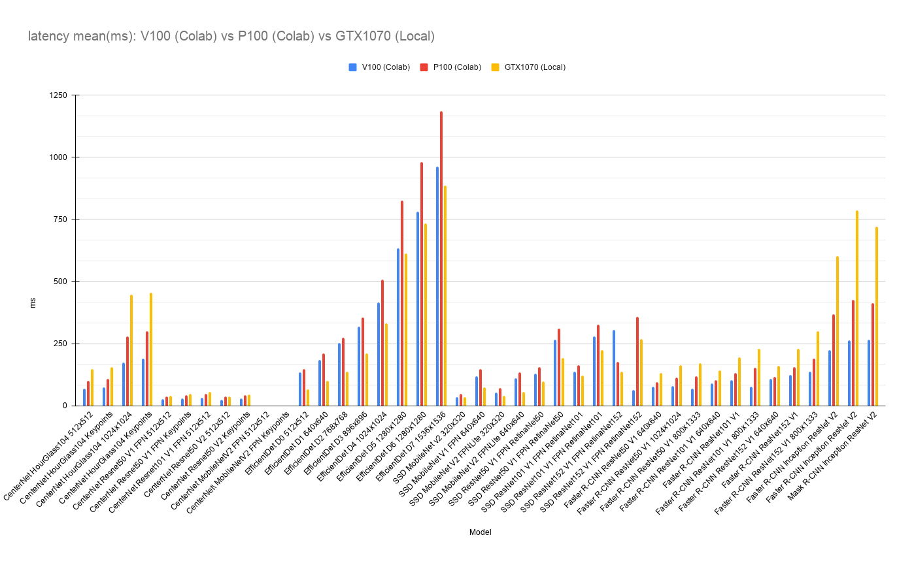

# TensorFlow 2 Detection Model Zoo Benchmarks
Latency comparison Colab V100 vs Colab P100 vs Local GTX1070.

## Environment
    
- Colab Pro (V100)
    - CPU: Intel(R) Xeon(R) CPU @ 2.30GHz 4 cores
    - GPU: NVIDIA Tesla V100
    - MEM: 25GB
- Colab Pro (P100)
    - CPU: Intel(R) Xeon(R) CPU @ 2.30GHz 4 cores
    - GPU: NVIDIA Tesla V100
    - MEM: 25GB
- Local GTX1070
    - CPU: AMD Ryzen 7 1700 Eight-Core Processor
    - GPU: NVIDIA GeForce GTX 1070
    - MEM: 32GB

## Dataset
- [COCO2017](https://cocodataset.org/#home) 

## How to benchmarks

Notebook will be up soon.

## Parameters
- Input batch size: 1
- No TensorRT.

## Results

- All results
    - [Colab V100](./results/Colab_TF2.4.1_COCO2017Val_V100_minimum_segment_size_50.csv)
    - [Colab P100](./results/Colab_TF2.4.1_P100.csv)
    - [Local GTX1070](./results/Local_TF2.4.1_GTX1070_CUDA11_TF_XLA_FLAGS_None.csv)
- Note: CenterNet MobileNetV2 (detection and keypoints) will result in an error inference by the saved model.

### latency mean (ms)
| Model                               | Input     |   Colab V100 |   Colab P100 |   Local GTX1070 |
|:------------------------------------|:----------|-------------:|-------------:|----------------:|
| CenterNet HourGlass104              | 512x512   |      6764.12 |     10048.5  |        14755.6  |
| CenterNet HourGlass104 Keypoints    | 512x512   |      7277.12 |     10891.2  |        15410.2  |
| CenterNet HourGlass104              | 1024x1024 |     17438.5  |     27789    |        44650.4  |
| CenterNet HourGlass104 Keypoints    | 1024x1024 |     18925.4  |     29992.9  |        45526.3  |
| CenterNet Resnet50 V1 FPN           | 512x512   |      2551.88 |      3705.22 |         4004.29 |
| CenterNet Resnet50 V1 FPN Keypoints | 512x512   |      2943.4  |      4253.81 |         4746.03 |
| CenterNet Resnet101 V1 FPN          | 512x512   |      3189.59 |      4716.38 |         5619.96 |
| CenterNet Resnet50 V2               | 512x512   |      2499.63 |      3679.83 |         3751.08 |
| CenterNet Resnet50 V2 Keypoints     | 512x512   |      2876.77 |      4236.3  |         4396.99 |
| CenterNet MobileNetV2 FPN           | 512x512   |         0    |         0    |            0    |
| CenterNet MobileNetV2 FPN Keypoints | 512x512   |         0    |         0    |            0    |
| EfficientDet D0                     | 512x512   |     13485.8  |     14618.3  |         6483.58 |
| EfficientDet D1                     | 640x640   |     18470.2  |     21053.4  |        10028.4  |
| EfficientDet D2                     | 768x768   |     25278.9  |     27342.2  |        13732.6  |
| EfficientDet D3                     | 896x896   |     31918.3  |     35610.8  |        21107.9  |
| EfficientDet D4                     | 1024x1024 |     41485.2  |     50774.1  |        33126.1  |
| EfficientDet D5                     | 1280x1280 |     63490.8  |     82546.3  |        61268.5  |
| EfficientDet D6                     | 1280x1280 |     78260.3  |     98242.6  |        73509.5  |
| EfficientDet D7                     | 1536x1536 |     96420.7  |    118702    |        88706.7  |
| SSD MobileNet v2                    | 320x320   |      3375.13 |      4742.42 |         3478.41 |
| SSD MobileNet V1 FPN                | 640x640   |     11858.9  |     14750    |         7382.57 |
| SSD MobileNet V2 FPNLite            | 320x320   |      5322.31 |      7133.86 |         3911.86 |
| SSD MobileNet V2 FPNLite            | 640x640   |     11148.6  |     13354.6  |         5461.87 |
| SSD ResNet50 V1 FPN RetinaNet50     | 640x640   |     12794.8  |     15492.3  |         9821.61 |
| SSD ResNet50 V1 FPN RetinaNet50     | 1024x1024 |     26494.1  |     31020.4  |        19247.2  |
| SSD ResNet101 V1 FPN RetinaNet101   | 640x640   |     13791.9  |     16286.3  |        12158.3  |
| SSD ResNet101 V1 FPN RetinaNet101   | 1024x1024 |     27992.4  |     32567.7  |        22504.7  |
| SSD ResNet152 V1 FPN RetinaNet152   | 640x640   |     30483.5  |     17729.5  |        13731.7  |
| SSD ResNet152 V1 FPN RetinaNet152   | 1024x1024 |      6395.3  |     35751.7  |        26924.6  |
| Faster R-CNN ResNet50 V1            | 640x640   |      7618.61 |      9427.38 |        13186.3  |
| Faster R-CNN ResNet50 V1            | 1024x1024 |      7860.58 |     11247.4  |        16382.8  |
| Faster R-CNN ResNet50 V1            | 800x1333  |      6968.94 |     11831.2  |        17158.8  |
| Faster R-CNN ResNet101 V1           | 640x640   |      9004.49 |     10386.5  |        14292.1  |
| Faster R-CNN ResNet101 V1           | 1024x1024 |     10248.9  |     13178.5  |        19467.4  |
| Faster R-CNN ResNet101 V1           | 800x1333  |      7754.21 |     15330.6  |        22783.9  |
| Faster R-CNN ResNet152 V1           | 640x640   |     10707.5  |     11556.2  |        15980.6  |
| Faster R-CNN ResNet152 V1           | 1024x1024 |     12424.1  |     15497.9  |        22988.5  |
| Faster R-CNN ResNet152 V1           | 800x1333  |     13797.9  |     18954.5  |        30127.3  |
| Faster R-CNN Inception ResNet V2    | 640x640   |     22362.5  |     36953.3  |        60349.5  |
| Faster R-CNN Inception ResNet V2    | 1024x1024 |     26242.2  |     42505.8  |        78775.4  |
| Mask R-CNN Inception ResNet V2      | 1024x1024 |     26677.4  |     41384    |        72033.6  |

