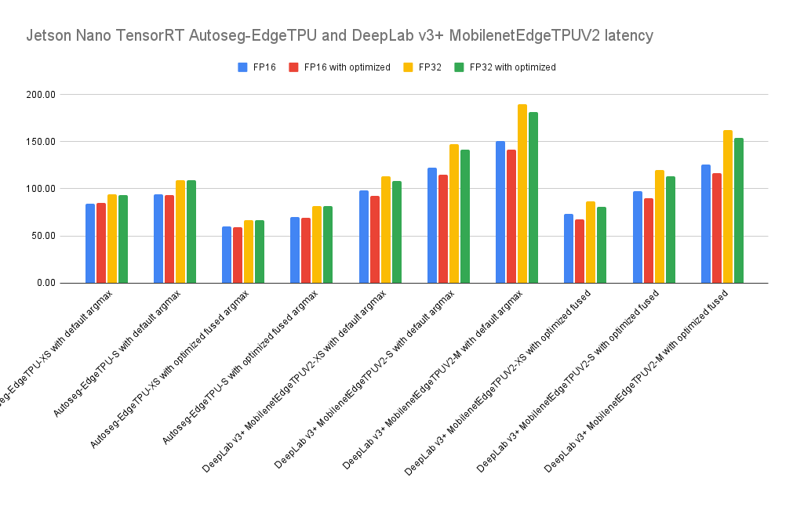

# Jetson Nano TensorRT Autoseg-EdgeTPU and DeepLab v3+ MobilenetEdgeTPUV2 latency

## Environment

- HW
  - Jetson Nano
- OS
  - JetPack 4.6
    Linux raspberrypi 5.10.36-v8+ #1418 SMP PREEMPT Thu May 13 18:19:53 BST 2021 aarch64 GNU/Linux
- SW
  - TensorRT 8

## How to benchmarks
Models
- [autoseg-edgetpu](https://tfhub.dev/google/collections/autoseg-edgetpu/1)
- [deeplab-edgetpu](https://tfhub.dev/google/collections/deeplab-edgetpu/1)

Convert ONNX model.
- [Convert ONNX Model on your Google Colab](https://github.com/NobuoTsukamoto/tensorrt-examples/tree/main/python/deeplabv3_edgetpuv2#convert-onnx-model-on-your-google-colab)

```
# Latancy
$ usr/src/tensorrt/bin/trtexec --onnx=_PATH_TO_/*.onnx [--fp16]
```


## Results

## Latency mean (ms)

| Model                                                         | FP16   | FP16 with optimized | FP32   | FP32 with optimized |
|:--------------------------------------------------------------|-------:|--------------------:|-------:|--------------------:|
| Autoseg-EdgeTPU-XS with default argmax                        | 84.31  | 85.04               | 93.99  | 93.58               |
| Autoseg-EdgeTPU-S with default argmax                         | 94.53  | 93.60               | 109.18 | 108.71              |
| Autoseg-EdgeTPU-XS with optimized fused argmax                | 60.41  | 59.53               | 67.1   | 66.48               |
| Autoseg-EdgeTPU-S with optimized fused argmax                 | 69.79  | 69.05               | 82.06  | 81.68               |
| DeepLab v3+ MobilenetEdgeTPUV2-XS with default argmax         | 98.63  | 92.73               | 113.62 | 108.28              |
| DeepLab v3+ MobilenetEdgeTPUV2-S with default argmax          | 122.27 | 114.61              | 146.90 | 141.30              |
| DeepLab v3+ MobilenetEdgeTPUV2-M with default argmax          | 150.33 | 141.30              | 189.69 | 181.41              |
| DeepLab v3+ MobilenetEdgeTPUV2-XS with optimized fused argmax | 73.59  | 67.92               | 86.34  | 81.00               |
| DeepLab v3+ MobilenetEdgeTPUV2-S with optimized fused argmax  | 97.41  | 89.60               | 119.77 | 112.89              |
| DeepLab v3+ MobilenetEdgeTPUV2-M with optimized fused argmax  | 125.74 | 116.54              | 162.46 | 154.03              |

^ with optimized: using [openvino2tensorflow](https://github.com/PINTO0309/openvino2tensorflow) and [tflite2tensorflow](https://github.com/PINTO0309/tflite2tensorflow)
<br>
<br>


## Youtube video

### Autoseg-EdgeTPU-XS with default argmax
[](https://youtu.be/q3E3QjAzNjw)

### Autoseg-EdgeTPU-S with default argmax
[](https://youtu.be/2ywjDXRT6qo)

### Autoseg-EdgeTPU-XS with optimized fused argmax
[](https://youtu.be/UZJm_LIjLMY)

### Autoseg-EdgeTPU-S with optimized fused argmax
[](https://youtu.be/EDffgHSg11A)

### DeepLab v3+ MobilenetEdgeTPUV2-XS with default argmax
[](https://youtu.be/gs0-V2GEj-c)

### DeepLab v3+ MobilenetEdgeTPUV2-S with default argmax
[](https://youtu.be/MMkuj2PfQ9E)

### DeepLab v3+ MobilenetEdgeTPUV2-M with default argmax
[](https://youtu.be/M20gLTxalWc)

### DeepLab v3+ MobilenetEdgeTPUV2-XS with optimized fused argmax
[](https://youtu.be/MgWQ_dcSCwk)

### DeepLab v3+ MobilenetEdgeTPUV2-S with optimized fused argmax
[](https://youtu.be/1kNmUjmR02k)

### DeepLab v3+ MobilenetEdgeTPUV2-M with optimized fused argmax
[](https://youtu.be/toO9L3gEIRE)
