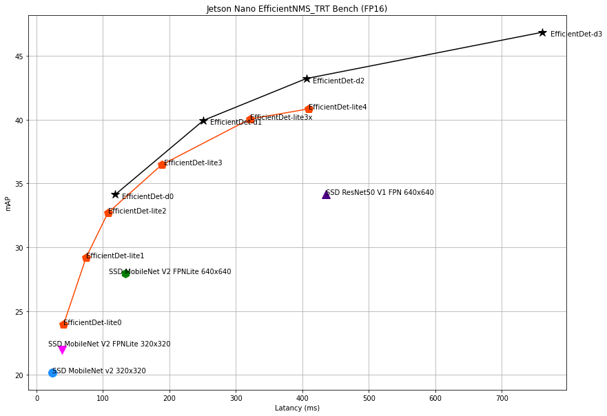

# EfficientDet Jetson Nano TensorRT Benchmarks

## Environment

- Jetson Nano
  - OS
    - JetPack 4.6.1 + TensorRT(22.05) plugin build 
      Linux jetson-desktop 4.9.253-tegra #1 SMP PREEMPT Mon Jul 26 12:13:06 PDT 2021 aarch64 aarch64 aarch64 GNU/Linux
- Host
  - nvcr.io/nvidia/tensorrt:22.04-py3

## How to benchmarks
Export ONNX model.
- [EfficientDet Object Detection in TensorRT](https://github.com/NVIDIA/TensorRT/tree/22.05/samples/python/efficientdet)
- [TensorFlow Object Detection API Models in TensorRT](https://github.com/NVIDIA/TensorRT/tree/22.05/samples/python/tensorflow_object_detection_api)
- [TensorRT EfficientDet-Lite Model Conversion AutoML Models to ONNX Model](https://github.com/NobuoTsukamoto/tensorrt-examples/blob/main/cpp/efficientdet/Export_EfficientDetLite_TensorRT.ipynb)

Latancy
```
# FP32
$ /usr/src/tensorrt/bin/trtexec --onnx=_PATH_TO_ONNX_ --workspace=1024

# FP16
$ /usr/src/tensorrt/bin/trtexec --onnx=_PATH_TO_ONNX_ --fp16 --workspace=1024
```

mAP
- [EfficientDet Object Detection in TensorRT - Evaluate mAP Metric](https://github.com/NVIDIA/TensorRT/tree/22.05/samples/python/efficientdet#evaluate-map-metric)
- [TensorFlow Object Detection API Models in TensorRT - Evaluate mAP Metric](https://github.com/NVIDIA/TensorRT/tree/22.05/samples/python/tensorflow_object_detection_api#benchmark-engine)

Models
- [Pretrained EfficientDet Checkpoints - google/automl](https://github.com/google/automl/tree/42ad3a40d237cb11b0894be69ba5855f41ae645f/efficientdet#2-pretrained-efficientdet-checkpoints)
-[TensorFlow 2 Detection Model Zoo](https://github.com/tensorflow/models/blob/master/research/object_detection/g3doc/tf2_detection_zoo.md)

## Results
- [All results](./results)

## Latency vs mAP

### Jetson Nano
| Model name | Input size | Kind | End-to-End Host Latency [ms] | Precision<br>mAP | Precision<br>mAP@.50IOU | Precision<br>mAP@.75IOU | Precision<br>mAP(small) | Precision<br>mAP(medium) | Precision<br>mAP(large) | Recall<br>AR@1 | Recall<br>AR@10 | Recall<br>AR@100 | Recall<br>AR@100(small) | Recall<br>AR@100(medium) | Recall<br>AR@100(large) |
|:--------------------|:--------|:-----|-------:|------:|------:|------:|------:|------:|------:|------:|------:|------:|------:|------:|------:|
| EfficientDet-lite0       | 320x320 | FP32 |  46.34 | 23.93 | 39.26 | 24.57 |  5.65 | 25.74 | 43.00 | 23.11 | 34.67 | 36.95 |  9.45 | 42.25 | 61.58 |
|                          |         | FP16 |  40.55 | 23.93 | 39.26 | 24.57 |  5.65 | 25.74 | 43.00 | 23.11 | 34.67 | 36.95 |  9.45 | 42.25 | 61.58 |
| EfficientDet-lite1       | 384x384 | FP32 |  83.62 | 29.18 | 46.42 | 30.04 | 10.28 | 32.43 | 48.16 | 26.24 | 40.22 | 42.69 | 16.79 | 48.42 | 66.22 |
|                          |         | FP16 |  74.44 | 29.17 | 46.42 | 30.03 | 10.29 | 32.43 | 48.16 | 26.24 | 40.21 | 42.69 | 16.81 | 48.41 | 66.24 |
| EfficientDet-lite2       | 448x448 | FP32 | 123.16 | 32.69 | 49.99 | 34.45 | 13.43 | 36.65 | 51.03 | 28.45 | 44.06 | 46.85 | 22.09 | 53.35 | 68.42 |
|                          |         | FP16 | 107.33 | 32.69 | 50.01 | 34.43 | 13.43 | 36.66 | 50.99 | 28.44 | 44.05 | 46.84 | 22.10 | 53.36 | 68.38 |
| EfficientDet-lite3       | 512x512 | FP32 | 217.52 | 36.46 | 53.60 | 38.53 | 15.45 | 42.08 | 55.38 | 30.98 | 47.68 | 50.41 | 23.07 | 57.94 | 73.31 |
|                          |         | FP16 | 188.24 | 36.46 | 53.61 | 38.54 | 15.45 | 42.08 | 55.37 | 30.97 | 47.67 | 50.40 | 23.07 | 57.95 | 73.27 |
| EfficientDet-lite3x      | 640x640 | FP32 | 389.58 | 40.04 | 58.67 | 42.76 | 21.10 | 44.31 | 55.75 | 32.88 | 52.01 | 55.16 | 33.36 | 60.84 | 72.39 |
|                          |         | FP16 | 321.11 | 40.04 | 58.67 | 42.77 | 21.10 | 44.31 | 55.75 | 32.88 | 52.01 | 55.16 | 33.36 | 60.84 | 72.39 |
| EfficientDet-lite4       | 640x640 | FP32 | 512.60 | 40.84 | 58.75 | 43.61 | 21.55 | 45.97 | 58.22 | 33.26 | 52.33 | 55.31 | 31.58 | 61.96 | 74.35 |
|                          |         | FP16 | 409.13 | 40.83 | 58.75 | 43.58 | 21.55 | 45.95 | 58.22 | 33.26 | 52.34 | 55.31 | 31.58 | 61.96 | 74.35 |
| EfficientDet-d0          | 512x512 | FP32 | 134.33 | 34.12 | 52.47 | 36.16 | 13.12 | 40.06 | 53.44 | 29.28 | 44.72 | 47.19 | 19.66 | 55.63 | 69.41 |
|                          |         | FP16 | 118.46 | 34.12 | 52.47 | 36.17 | 13.13 | 40.10 | 53.43 | 29.30 | 44.73 | 47.18 | 19.64 | 55.64 | 69.42 |
| EfficientDet-d1          | 640x640 | FP32 | 294.00 | 39.94 | 59.06 | 42.31 | 21.09 | 45.87 | 57.40 | 32.51 | 50.56 | 53.45 | 30.71 | 60.77 | 72.76 |
|                          |         | FP16 | 251.24 | 39.94 | 59.05 | 42.31 | 21.08 | 45.87 | 57.37 | 32.52 | 50.56 | 53.46 | 30.70 | 60.75 | 72.80 |
| EfficientDet-d2          | 768x768 | FP32 | 464.61 | 43.22 | 62.70 | 46.35 | 23.70 | 48.60 | 60.20 | 34.24 | 53.63 | 56.81 | 34.49 | 63.42 | 74.21 |
|                          |         | FP16 | 405.80 | 43.21 | 62.70 | 46.35 | 23.69 | 48.59 | 60.20 | 34.23 | 53.63 | 56.80 | 34.46 | 63.43 | 74.23 |
| EfficientDet-d3          | 896x896 | FP32 | 879.18 | 46.84 | 66.05 | 50.35 | 30.16 | 51.69 | 62.14 | 36.36 | 57.91 | 61.23 | 42.15 | 66.56 | 77.44 |
|                          |         | FP16 | 760.44 | 46.83 | 66.04 | 50.33 | 30.14 | 51.66 | 62.11 | 36.35 | 57.91 | 61.21 | 42.11 | 66.53 | 77.42 |
| SSD MobileNet v2         | 320x320 | FP32 |  26.96 | 20.18 | 34.74 | 20.12 |  2.67 | 17.58 | 41.43 | 21.43 | 32.83 | 34.76 |  7.31 | 35.50 | 65.62 |
|                          |         | FP16 |  24.31 | 20.18 | 34.74 | 20.12 |  2.67 | 17.58 | 41.43 | 21.43 | 32.83 | 34.76 |  7.31 | 35.50 | 65.62 |
| SSD MobileNet V2 FPNLite | 320x320 | FP32 |  39.54 | 21.97 | 36.95 | 22.73 |  5.32 | 23.39 | 38.60 | 21.76 | 33.62 | 36.18 |  8.06 | 41.97 | 60.75 |
|                          |         | FP16 |  37.99 | 21.97 | 36.95 | 22.73 |  5.34 | 23.39 | 38.60 | 21.76 | 33.61 | 36.18 |  8.06 | 41.97 | 60.75 |
| SSD MobileNet V2 FPNLite | 640x640 | FP32 | 138.84 | 27.92 | 46.11 | 29.55 | 11.97 | 30.85 | 40.89 | 25.65 | 41.06 | 44.23 | 21.99 | 48.82 | 62.29 |
|                          |         | FP16 | 133.76 | 27.92 | 46.11 | 29.56 | 11.97 | 30.85 | 40.89 | 25.65 | 41.06 | 44.23 | 21.99 | 48.82 | 62.28 |
| SSD ResNet50 V1 FPN      | 640x640 | FP32 | 735.68 | 34.15 | 51.87 | 37.16 | 16.52 | 37.55 | 49.31 | 30.27 | 48.07 | 51.75 | 28.53 | 56.95 | 71.40 |
|                          |         | FP16 | 435.36 | 34.16 | 51.87 | 37.18 | 16.52 | 37.56 | 49.31 | 30.27 | 48.06 | 51.74 | 28.53 | 56.94 | 71.35 |





## Youtube video

Code
- https://github.com/NobuoTsukamoto/tensorrt-examples/tree/main/cpp/efficientdet

```
./trt_efficientdet \
  _PATH_TO_TRT_MODEL_FILE \
  --width=MODEL_INPUT_WIDTH \
  --height=MODEL_INPUT_HEIGHT \
  --file=_PATH_TO_INPUT_VIDEO_FILE \
  --score=0.4 \
  --label=_PATH_TO_/tensorrt-examples/models/coco_labels.txt \
  --output=_PATH_TO_OUTPUT_VIDEO_FILE
```

### EfficientDet-lite0 FP16
[](https://www.youtube.com/watch?v=eR-xN1lGE2s)

### EfficientDet-lite1 FP16
[](https://www.youtube.com/watch?v=tYTWntlrW-0)
    
### EfficientDet-lite2 FP16
[](https://www.youtube.com/watch?v=cXaTTipd4pM)

### EfficientDet-lite3 FP16
[](https://www.youtube.com/watch?v=9yB_diWI1Hk)

### EfficientDet-lite3x FP16
[](https://www.youtube.com/watch?v=GcdrwMMF4O4)

### EfficientDet-lite4 FP16
[](https://www.youtube.com/watch?v=A0bdgxcqr-c)