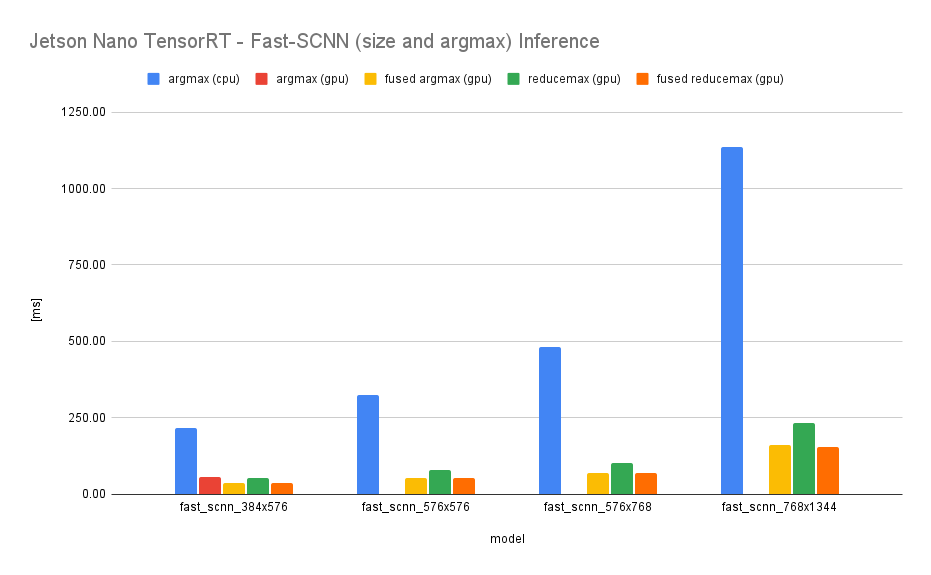

# Jetson Nano TensorRT Fast-SCNN benchmarks

## Environment

- HW
  - Jetson Nano
- OS
  - JetPack 4.6
    Linux raspberrypi 5.10.36-v8+ #1418 SMP PREEMPT Thu May 13 18:19:53 BST 2021 aarch64 GNU/Linux
- SW
  - TensorRT 8

## How to benchmarks
Models (ONNX)
- [Tramac/Fast-SCNN-pytorch](https://github.com/Tramac/Fast-SCNN-pytorch)
- [PINTO_model_zoo/228_Fast-SCNN](https://github.com/PINTO0309/PINTO_model_zoo/tree/main/228_Fast-SCNN)

```
# Latancy
$ usr/src/tensorrt/bin/trtexec --onnx=_PATH_TO_/*.onnx [--fp16]
```


## Results

## End-to-End Host Latency mean (ms)

| Model (Input) | FP16    | FP32   |
|:--------------|--------:|-------:|
| 384x384       |  18.05  |  18.46 |
| 384x576       |  25.21  |  25.33 |
| 576x576       |  36.96  |  37.27 |
| 576x768       |  49.09  |  49.02 |
| 768x1344      |  111.74 | 111.89 |

## CPU argmax(numpy) vs default argmax(GPU) vs fused argmax(GPU)

Measures latency when changing argmax, inspired by [the Semantic segmentation task of EdgeTPU-optimized Vision Models](https://github.com/tensorflow/models/tree/master/official/projects/edgetpu/vision#argmax-fusion-to-improve-segmentation-model-latency).
Adding an Argmax ope and converting it to a TensorRT serialize engine may fail due to size and number of classes. If you replace it with an Ope of Fused argmax or reducemax, the conversion will be successful and the inference speed will be improved (Please note that it affects accuracy).

- Standard argmax (CPU Numpy)
- Standard argmax (GPU ONNX Ope)
- Fused argmax (GPU ONNX Ope: Resize Bilinear -> Argmax -> Resize Nearest)
- Reducemax (GPU ONNX Ope: ReduceMax)
- Fused reducemax (GPU ONNX Ope: Resize Bilinear -> ReduceMax -> Resize Nearest)


The script and inference code for adding ope of argmax are as follows.
- [add_fast_scnn_argmax.py](https://github.com/NobuoTsukamoto/tensorrt-examples/blob/main/python/fast_scnn/add_fast_scnn_argmax.py)
- [trt_fast_scnn_image.py](https://github.com/NobuoTsukamoto/tensorrt-examples/blob/main/python/fast_scnn/trt_fast_scnn_image.py)

| Model (Input) | Type                  | FP16    | FP32    |
|:--------------|:----------------------|--------:|--------:|
|  384x576      | argmax (cpu numpy)    |  218.81 |  215.97 |
|               | argmax (gpu)          |   53.68 |   55.28 |
|               | fused argmax (gpu)    |   35.43 |   35.76 |
|               | reducemax (gpu)       |   51.61 |   53.14 |
|               | fused reducemax (gpu) |   35.23 |   36.56 |
|  576x576      | argmax (cpu numpy)    |  316.57 |  325.35 |  
|               | argmax (gpu)          |       * |       * | 
|               | fused argmax (gpu)    |   51.99 |   53.06 | 
|               | reducemax (gpu)       |   76.19 |   78.17 | 
|               | fused reducemax (gpu) |   52.90 |   53.61 | 
|  576x768      | argmax (cpu numpy)    |  479.53 |  482.05 | 
|               | argmax (gpu)          |       * |       * | 
|               | fused argmax (gpu)    |   68.31 |   68.84 | 
|               | reducemax (gpu)       |  100.21 |  102.66 | 
|               | fused reducemax (gpu) |   69.13 |   69.83 | 
|  768x1344     | argmax (cpu numpy)    | 1142.62 | 1136.14 |  
|               | argmax (gpu)          |       * |       * | 
|               | fused argmax (gpu)    |  157.27 |  162.06 | 
|               | reducemax (gpu)       |  227.28 |  232.30 | 
|               | fused reducemax (gpu) |  154.89 |  155.98 | 

- *: terminate called after throwing an instance of 'nvinfer1::CudaRuntimeError'



## Youtube video

### 384x384 FP16
[](https://youtu.be/1qjGCSC2XYo)

### 384x576 FP16
[](https://youtu.be/QtQDUJ0hJ5o)

### 576x576 FP16
[](https://youtu.be/Qy4S4_5JCAM)

### 576x768 FP16
[](https://youtu.be/bzFMwWJak-8)

### 768x1344 FP16
[](https://youtu.be/Lg6BvEgN9AA)
